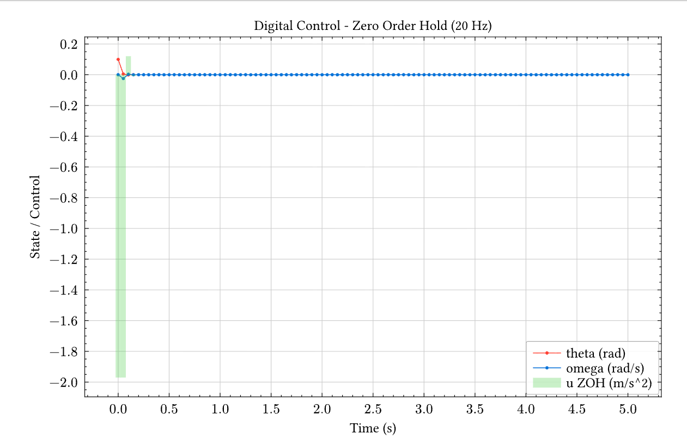

# Appendix: ODE Solver

Kleis provides numerical integration of ordinary differential equations through the `ode45` function. This implements the Dormand-Prince 5(4) adaptive step-size method, suitable for non-stiff initial value problems.

> **Note:** The ODE solver is available when Kleis is compiled with the `numerical` feature.

## Basic Usage

```kleis
ode45(dynamics, y0, t_span, dt)
```

| Argument | Type | Description |
|----------|------|-------------|
| `dynamics` | Lambda | System dynamics function (see below) |
| `y0` | List | Initial state vector |
| `t_span` | `[t0, t1]` | Time interval |
| `dt` | Number | Output time step (optional, default 0.1) |

### The Dynamics Function

The `dynamics` argument is a lambda of the form:

```kleis
lambda t y . [dy0/dt, dy1/dt, ...]
```

where:
- `t` is the current time (scalar)
- `y` is the current state vector `[y0, y1, ...]`
- The return value is a list of derivatives, same length as `y`

**For higher-order ODEs**, convert to a system of first-order equations by introducing auxiliary state variables:

| Original Equation | State Vector | Dynamics Return |
|-------------------|--------------|-----------------|
| y' = f(t, y) | `[y]` | `[f(t, y)]` |
| y'' = f(t, y, y') | `[y, y']` | `[y', f(t, y, y')]` |
| y''' = f(t, y, y', y'') | `[y, y', y'']` | `[y', y'', f(...)]` |

**Example**: The second-order equation y'' + y = 0 becomes:
- State: `[y, v]` where v = y'
- Dynamics: `[v, -y]` since y' = v and v' = -y

### Accessing State Components

Use `nth(list, index)` to extract elements from the state vector (0-indexed):

```kleis
lambda t y .
  let x = nth(y, 0) in    // first component
  let v = nth(y, 1) in    // second component
  [v, negate(x)]          // return [dx/dt, dv/dt]
```

### Returns

A list of `[t, [y0, y1, ...]]` pairs representing the trajectory.

## Simple Example: Exponential Decay

The equation dy/dt = -y with y(0) = 1 has the solution y(t) = e^(-t).

```kleis
let decay = lambda t y . [negate(nth(y, 0))] in
let traj = ode45(decay, [1.0], [0, 3], 0.5) in
traj
// → [[0, [1.0]], [0.5, [0.606...]], [1.0, [0.367...]], ...]
```

## Harmonic Oscillator

A second-order ODE like x'' = -x is converted to a first-order system:
- State: `[x, v]` where v = x'
- Dynamics: `[x', v'] = [v, -x]`

```kleis
let oscillator = lambda t y .
  let x = nth(y, 0) in
  let v = nth(y, 1) in
  [v, negate(x)]
in
ode45(oscillator, [1, 0], [0, 6.28], 0.1)
// Completes one period, returns to [1, 0]
```

---

## Control Systems: Inverted Pendulum with LQR

This example demonstrates a complete control system workflow:

1. **System modeling** - Nonlinear pendulum dynamics
2. **LQR design** - Optimal feedback gains via CARE
3. **Simulation** - Closed-loop response with `ode45`
4. **Visualization** - State and control trajectories

### Problem Setup

An inverted pendulum on an acceleration-controlled cart:

- **State**: `[θ, ω]` where θ is angle from vertical, ω is angular velocity
- **Control**: u = cart acceleration (m/s²)
- **Dynamics**: θ'' = (g/L)·sin(θ) + (u/L)·cos(θ)

### Linearized System

Around the upright equilibrium (θ = 0):

```
A = [0,    1  ]     B = [0  ]
    [g/L,  0  ]         [1/L]
```

With L = 0.5m and g = 9.81 m/s², the open-loop eigenvalues are ±4.43 — one unstable pole.

### Complete Example

```kleis
// Physical parameters
define ell = 0.5        // pendulum length (m)
define grav = 9.81      // gravity (m/s²)

// Linearized system matrices
define a_matrix = [[0, 1], [grav / ell, 0]]
define b_matrix = [[0], [1 / ell]]

// LQR cost weights
define q_matrix = [[10, 0], [0, 1]]  // Penalize angle more than velocity
define r_matrix = [[1]]

// Helper functions
define get_time(pt) = nth(pt, 0)
define get_theta(pt) = nth(nth(pt, 1), 0)
define get_omega(pt) = nth(nth(pt, 1), 1)

example "LQR pendulum stabilization" {
  // Compute optimal LQR gains by solving CARE
  let result = lqr(a_matrix, b_matrix, q_matrix, r_matrix) in
  let k1 = nth(nth(nth(result, 0), 0), 0) in
  let k2 = nth(nth(nth(result, 0), 0), 1) in
  
  out("LQR gains: k1, k2 =")
  out(k1)  // ≈ 20.12
  out(k2)  // ≈ 4.60
  
  out("Open-loop eigenvalues (unstable):")
  out(eigenvalues(a_matrix))  // [4.43, -4.43]
  
  // Nonlinear dynamics with LQR feedback: u = -K·x
  let dyn = lambda t y .
    let th = nth(y, 0) in
    let om = nth(y, 1) in
    let u = negate(k1*th + k2*om) in
    [om, (grav/ell)*sin(th) + (u/ell)*cos(th)]
  in
  
  // Simulate from 17° initial tilt
  let traj = ode45(dyn, [0.3, 0], [0, 5], 0.05) in
  
  // Extract time series
  let times = list_map(lambda p . get_time(p), traj) in
  let thetas = list_map(lambda p . get_theta(p), traj) in
  let omegas = list_map(lambda p . get_omega(p), traj) in
  let controls = list_map(lambda p . 
    negate(20.12*get_theta(p) + 4.60*get_omega(p)), traj) in
  
  // Plot state and control
  diagram(
    plot(times, thetas, color = "red", label = "theta (rad)"),
    plot(times, omegas, color = "blue", label = "omega (rad/s)"),
    plot(times, controls, color = "green", label = "u (m/s^2)"),
    title = "Inverted Pendulum - LQR Stabilization",
    xlabel = "Time (s)",
    ylabel = "State / Control",
    legend = "right + bottom",
    width = 16,
    height = 10
  )
}
```

### Result


The plot shows:

- **θ (red)**: Angle smoothly decays from 0.3 rad to 0
- **ω (blue)**: Angular velocity with brief negative swing, then settles
- **u (green)**: Initial -6 m/s² control effort (cart accelerates backward to catch falling pendulum), then decays to zero

The LQR controller stabilizes the pendulum in approximately 2 seconds with no overshoot — optimal behavior for the given Q and R weights.

---

## Digital Control: Discrete-Time LQR with Zero-Order Hold

Real controllers are typically implemented digitally with a fixed sample rate. This example shows the same inverted pendulum controlled with a discrete-time LQR designed using the Discrete Algebraic Riccati Equation (DARE).

### Key Differences from Continuous Control

| Aspect | Continuous | Discrete |
|--------|------------|----------|
| Design method | `lqr()` → CARE | `dlqr()` → DARE |
| System matrices | A, B | Aₐ = eᴬᵀˢ, Bₐ ≈ Ts·B |
| Control update | Continuous | Every Ts seconds (ZOH) |
| Stability check | Re(λ) < 0 | \|λ\| < 1 |

### Complete Example

```kleis
// Physical parameters  
define ell = 0.5        // pendulum length (m)
define grav = 9.81      // gravity (m/s²)
define ts = 0.05        // sample time (s) - 20 Hz

// Continuous-time linearized system
define a_cont = [[0, 1], [grav / ell, 0]]
define b_cont = [[0], [1 / ell]]

// Discretize using matrix exponential
define a_disc = expm(scalar_matrix_mul(ts, a_cont))
define b_disc = scalar_matrix_mul(ts, b_cont)

// LQR weights
define q_matrix = [[1, 0], [0, 0.1]]
define r_matrix = [[1]]

example "Digital LQR with Zero-Order Hold" {
  // Compute discrete LQR gains using DARE
  let result = dlqr(a_disc, b_disc, q_matrix, r_matrix) in
  let k_matrix = nth(result, 0) in
  
  out("Discrete LQR gains K:")
  out(k_matrix)  // ≈ [[20.18, 4.59]]
  
  // Check closed-loop stability (eigenvalues inside unit circle)
  let bk = matmul(b_disc, k_matrix) in
  let a_cl = matrix_sub(a_disc, bk) in
  out("Closed-loop eigenvalues (|λ| < 1 for stability):")
  out(eigenvalues(a_cl))
  
  // Extract gains for simulation
  let k1 = nth(nth(k_matrix, 0), 0) in
  let k2 = nth(nth(k_matrix, 0), 1) in
  
  // Discrete-time simulation with Euler integration
  let n_steps = 100 in
  let x0 = [0.1, 0] in  // 5.7° initial tilt
  
  // Recursive simulation: each step applies ZOH control
  let simulate = lambda acc i .
    let prev = nth(acc, length(acc) - 1) in
    let t_prev = nth(prev, 0) in
    let x_prev = nth(prev, 1) in
    let th = nth(x_prev, 0) in
    let om = nth(x_prev, 1) in
    let u = negate(k1*th + k2*om) in  // ZOH control
    let th_ddot = (grav/ell)*sin(th) + (u/ell)*cos(th) in
    let th_new = th + om*ts in
    let om_new = om + th_ddot*ts in
    list_append(acc, [[t_prev + ts, [th_new, om_new], u]])
  in
  
  let init_u = negate(k1*nth(x0, 0) + k2*nth(x0, 1)) in
  let traj = list_fold(simulate, [[0, x0, init_u]], range(0, n_steps)) in
  
  // Extract time series
  let times = list_map(lambda p . nth(p, 0), traj) in
  let thetas = list_map(lambda p . nth(nth(p, 1), 0), traj) in
  let omegas = list_map(lambda p . nth(nth(p, 1), 1), traj) in
  let controls = list_map(lambda p . nth(p, 2), traj) in
  
  // Plot with bar chart showing ZOH control action
  diagram(
    plot(times, thetas, color = "red", label = "theta (rad)"),
    plot(times, omegas, color = "blue", label = "omega (rad/s)"),
    bar(times, controls, color = "green", label = "u ZOH (m/s^2)", 
        opacity = 0.3, width = 0.05),
    title = "Digital Control - Zero Order Hold (20 Hz)",
    xlabel = "Time (s)",
    ylabel = "State / Control",
    legend = "right + bottom",
    width = 16,
    height = 10
  )
}
```

### Result



The bar chart shows the **zero-order hold** (ZOH) nature of digital control — the control signal is constant between sample times (every 50ms). Compare to the smooth continuous control in the previous example.

### Note on LQR Tuning

For the inverted pendulum, the gains are relatively insensitive to Q/R weights. This is expected for unstable systems: the Riccati equation solution is dominated by stabilization requirements, leaving little room for performance tuning. For systems where Q/R significantly affects the response, consider stable plants like temperature control or mass-spring-damper systems.

---

## Technical Notes

### Adaptive Step Size

The Dormand-Prince 5(4) method adapts its internal step size for accuracy while outputting at the requested `dt` intervals. This handles stiff transients automatically.

### Lambda Closures

The dynamics lambda can capture variables from the enclosing scope:

```kleis
let k = 2.0 in
let dyn = lambda t y . [negate(k * nth(y, 0))] in
ode45(dyn, [1], [0, 1], 0.1)
// k is captured in the closure
```

---

## See Also

- [LAPACK Functions](./lapack.md) - Matrix decompositions, `lqr()`, `dlqr()`, `eigenvalues()`
- [Jupyter Notebook](../chapters/21-jupyter-notebook.md) - Interactive plotting
- [Built-in Functions](./builtin-functions.md) - `list_map`, `nth`, `list_fold`, etc.

