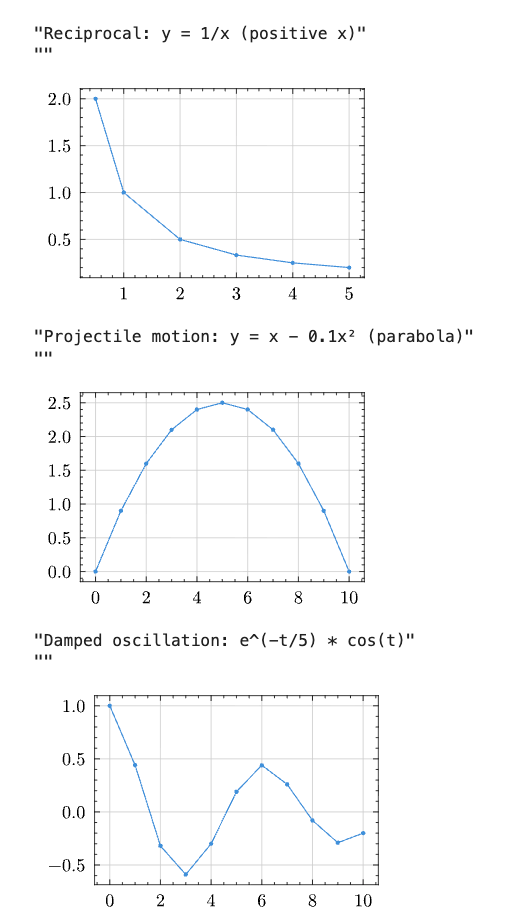

# Jupyter Notebook

Kleis provides Jupyter kernel support, allowing you to write and execute Kleis code in Jupyter notebooks. This is ideal for:


*JupyterLab launcher with Kleis and Kleis Numeric kernels*

- **Interactive exploration** of mathematical concepts
- **Teaching** mathematical foundations
- **Documenting** proofs and derivations
- **Numerical computation** with LAPACK operations
- **Publication-quality plotting** with Lilaq/Typst integration

## Quick Start

```bash
cd kleis-notebook
./start-jupyter.sh
```

This will:
1. Create a Python virtual environment (if needed)
2. Install JupyterLab and the Kleis kernel
3. Launch JupyterLab in your browser

## Installation

### Prerequisites

1. **Python 3.8+** with pip
2. **Kleis binary** compiled with numerical features:

```bash
cd /path/to/kleis
export Z3_SYS_Z3_HEADER=/opt/homebrew/opt/z3/include/z3.h  # macOS Apple Silicon
cargo install --path . --features numerical
```

> **Note:** The `--features numerical` flag enables LAPACK operations for eigenvalues, SVD, matrix inversion, and more.

### Install the Kernel

```bash
cd kleis-notebook

# Option 1: Use the launcher script (recommended)
./start-jupyter.sh install

# Option 2: Manual installation
python3 -m venv venv
source venv/bin/activate
pip install -e .
pip install jupyterlab
python -m kleis_kernel.install
python -m kleis_kernel.install_numeric
```

## Using Kleis in Jupyter

### Creating a Notebook

1. Start JupyterLab: `./start-jupyter.sh`
2. Click **New Notebook**
3. Select **Kleis** or **Kleis Numeric** kernel

### Example: Defining a Group

```kleis
structure Group(G) {
    operation (*) : G × G → G
    element e : G
    
    axiom left_identity: ∀(a : G). e * a = a
    axiom right_identity: ∀(a : G). a * e = a
    axiom associativity: ∀(a b c : G). (a * b) * c = a * (b * c)
}
```

### Example: Testing Properties

```kleis
example "group identity" {
    assert(e * e = e)
}
```

Output:
```
✅ group identity passed
```

### Example: Numerical Computation

```kleis
eigenvalues([[1.0, 2.0], [3.0, 4.0]])
```

Output:
```
[-0.3722813232690143, 5.372281323269014]
```

## REPL Commands

Use REPL commands directly in notebook cells:

| Command | Description | Example |
|---------|-------------|---------|
| `:type <expr>` | Show inferred type | `:type 1 + 2` |
| `:eval <expr>` | Evaluate concretely | `:eval det([[1,2],[3,4]])` |
| `:verify <expr>` | Verify with Z3 | `:verify ∀(x : ℝ). x + 0 = x` |
| `:ast <expr>` | Show parsed AST | `:ast sin(x)` |
| `:env` | Show session context | `:env` |
| `:load <file>` | Load .kleis file | `:load stdlib/prelude.kleis` |

## Jupyter Magic Commands

| Command | Description |
|---------|-------------|
| `%reset` | Clear session context (forget all definitions) |
| `%context` | Show accumulated definitions |
| `%version` | Show Kleis and kernel versions |

## Numerical Operations

When Kleis is compiled with `--features numerical`, these LAPACK-powered operations are available:

### Eigenvalue Decomposition

```kleis
// Compute eigenvalues
eigenvalues([[4.0, 2.0], [1.0, 3.0]])
// → [5.0, 2.0]

// Full decomposition (eigenvalues + eigenvectors)
eig([[4.0, 2.0], [1.0, 3.0]])
// → [[5.0, 2.0], [[0.894, 0.707], [-0.447, 0.707]]]
```

### Matrix Factorizations

```kleis
// Singular Value Decomposition
svd([[1.0, 2.0], [3.0, 4.0], [5.0, 6.0]])
// → (U, S, Vt)

// QR Decomposition
qr([[1.0, 2.0], [3.0, 4.0]])
// → (Q, R)

// Cholesky Decomposition (symmetric positive definite)
cholesky([[4.0, 2.0], [2.0, 5.0]])
// → Lower triangular L where A = L * L^T

// Schur Decomposition
schur([[1.0, 2.0], [3.0, 4.0]])
// → (U, T, eigenvalues)
```

### Linear Algebra

```kleis
// Matrix inverse
inv([[1.0, 2.0], [3.0, 4.0]])
// → Matrix(2, 2, [-2, 1, 1.5, -0.5])

// Determinant
det([[1.0, 2.0], [3.0, 4.0]])
// → -2

// Solve linear system Ax = b
solve([[3.0, 1.0], [1.0, 2.0]], [9.0, 8.0])
// → [2.0, 3.0]

// Matrix rank
rank([[1.0, 2.0, 3.0], [4.0, 5.0, 6.0], [7.0, 8.0, 9.0]])
// → 2

// Condition number
cond([[1.0, 2.0], [3.0, 4.0]])
// → 14.933...

// Matrix norms
norm([[1.0, 2.0], [3.0, 4.0]])
// → Frobenius norm
```

### Matrix Exponential

```kleis
// e^A (useful for differential equations)
expm([[0.0, 1.0], [-1.0, 0.0]])
// → rotation matrix
```

## Matrix Syntax

Matrices can be specified using nested list syntax:

```kleis
// 2×2 matrix (row-major order)
[[1, 2], [3, 4]]

// 3×3 identity matrix concept
[[1, 0, 0], [0, 1, 0], [0, 0, 1]]

// Column vector as 3×1 matrix
[[1], [2], [3]]

// Row vector as 1×3 matrix
[[1, 2, 3]]
```

## Session Persistence

Definitions persist across cells within a session:

**Cell 1:**
```kleis
define square(x) = x * x
```

**Cell 2:**
```kleis
example "use square" {
    assert(square(3) = 9)
}
```

Output:
```
✅ use square passed
```

Use `%reset` to clear all definitions and start fresh.

## Tips for Effective Notebooks

1. **Start with imports and definitions** at the top
2. **Use example blocks** for testable assertions
3. **Use `:eval`** for quick numerical calculations
4. **Use `:verify`** for Z3-backed proofs
5. **Document with markdown cells** between code
6. **Save frequently** - Kleis notebooks are standard `.ipynb` files

## Troubleshooting

### "kleis binary not found"

Install Kleis with:
```bash
cd /path/to/kleis
export Z3_SYS_Z3_HEADER=/opt/homebrew/opt/z3/include/z3.h
cargo install --path . --features numerical
```

### Numerical operations return symbolic expressions

Make sure Kleis was compiled with `--features numerical`:
```bash
cargo install --path . --features numerical
```

### Kernel dies unexpectedly

Check the terminal for error messages. Common causes:
- Z3 timeout on complex verification
- Memory issues with large matrices

### Unicode input

Use standard Kleis Unicode shortcuts:
- `\forall` → `∀`
- `\exists` → `∃`
- `\in` → `∈`
- `\R` → `ℝ`
- `\N` → `ℕ`
- `\Z` → `ℤ`

## Example Notebook

Here's a complete example exploring matrix properties:

**Cell 1: Setup**
```kleis
// Define a 2×2 matrix
let A = [[1.0, 2.0], [3.0, 4.0]]
```

**Cell 2: Basic properties**
```kleis
det(A)        // → -2
trace(A)      // → 5 (not yet implemented, use 1+4)
```

**Cell 3: Eigenvalues**
```kleis
eigenvalues(A)
// → [-0.372..., 5.372...]
```

**Cell 4: Verify Cayley-Hamilton**
```kleis
// A matrix satisfies its characteristic polynomial
// For 2×2: A² - trace(A)*A + det(A)*I = 0
// This is verified numerically by the eigenvalue product
```

**Cell 5: Matrix inverse**
```kleis
let Ainv = inv(A)
// Verify: A * Ainv should be identity
// (Matrix multiplication coming soon!)
```

## Plotting

Kleis integrates with **Lilaq** (Typst's plotting library) to generate publication-quality plots directly in Jupyter notebooks. Plots are rendered as scalable SVG graphics.



*Examples of Kleis plots: reciprocal function, projectile motion, and damped oscillation*

### Requirements

- **Typst CLI** must be installed: `brew install typst` (macOS) or see [typst.app](https://typst.app)

### Plot Functions

| Function | Description | Example |
|----------|-------------|---------|
| `plot(x, y)` | Line plot | `plot([0,1,2], [0,1,4])` |
| `scatter(x, y)` | Scatter plot | `scatter([1,2,3], [2.1,3.9,6.2])` |
| `bar(x, heights)` | Vertical bars | `bar([1,2,3], [10,25,15])` |
| `hbar(y, widths)` | Horizontal bars | `hbar([1,2,3], [10,25,15])` |
| `stem(x, y)` | Stem plot | `stem([0,1,2], [0,1,1])` |
| `hstem(x, y)` | Horizontal stem | `hstem([0,1,2], [0,1,1])` |
| `fill_between(x, y)` | Area under curve | `fill_between([0,1,2], [1,2,4])` |
| `boxplot(d1, d2, ...)` | Box and whisker | `boxplot([1,2,3], [4,5,6])` |
| `hboxplot(...)` | Horizontal boxplot | `hboxplot([1,2,3], [4,5,6])` |
| `heatmap(matrix)` | 2D color grid | `heatmap([[1,2],[3,4]])` |
| `colormesh(matrix)` | Alias for heatmap | `colormesh([[1,2],[3,4]])` |
| `contour(matrix)` | Contour lines | `contour([[1,2],[3,4]])` |
| `quiver(x, y, dirs)` | Vector field | See example below |

### Basic Examples

```kleis
import "stdlib/prelude.kleis"

example "line plot" {
    // Line plot: y = x²
    plot([0, 1, 2, 3, 4, 5], [0, 1, 4, 9, 16, 25])
}

example "scatter plot" {
    scatter([1, 2, 3, 4, 5], [2.1, 3.9, 6.2, 7.8, 10.1])
}

example "bar chart" {
    bar([1, 2, 3, 4, 5], [10, 25, 15, 30, 20])
}

example "heatmap" {
    heatmap([
        [1.0, 2.0, 3.0],
        [4.0, 5.0, 6.0],
        [7.0, 8.0, 9.0]
    ])
}
```

### Physics Examples

```kleis
import "stdlib/prelude.kleis"

example "damped oscillation" {
    // e^(-t/5) × cos(t)
    plot(
        [0, 1, 2, 3, 4, 5, 6, 7, 8, 9, 10],
        [1.0, 0.44, negate(0.32), negate(0.59), negate(0.30), 
         0.19, 0.44, 0.26, negate(0.08), negate(0.29), negate(0.20)]
    )
}

example "projectile motion" {
    // y = x - 0.1x²
    plot(
        [0, 1, 2, 3, 4, 5, 6, 7, 8, 9, 10],
        [0, 0.9, 1.6, 2.1, 2.4, 2.5, 2.4, 2.1, 1.6, 0.9, 0]
    )
}
```

### Vector Field Example

```kleis
import "stdlib/prelude.kleis"

example "vector field" {
    quiver(
        [0, 1],         // x coordinates
        [0, 1],         // y coordinates
        [               // 2×2 grid of [u, v] directions
            [[1, 0], [0, 1]],
            [[0, negate(1)], [negate(1), 0]]
        ]
    )
}
```

### Titles

All plot functions accept an optional title as the last argument:

```kleis
import "stdlib/prelude.kleis"

example "with title" {
    plot([0, 1, 2, 3], [0, 1, 4, 9], "Quadratic Growth")
    scatter([1, 2, 3], [1.1, 2.0, 2.9], "Experimental Data")
}
```

### Complete Example Notebook

**Cell 1: Import stdlib**
```kleis
import "stdlib/prelude.kleis"
```

**Cell 2: Line plot**
```kleis
plot([0, 1, 2, 3, 4], [0, 1, 4, 9, 16], "y = x²")
```

**Cell 3: Multiple plots in one cell**
```kleis
example "quadratic" {
    plot([0, 1, 2, 3, 4], [0, 1, 4, 9, 16])
}

example "linear" {
    plot([0, 1, 2, 3, 4], [1, 3, 5, 7, 9])
}
```

Both plots will be displayed sequentially.

### Future Enhancements

See the [Plotting Roadmap](../../PLOTTING_ROADMAP.md) for planned features:
- Function plotting (`fplot`)
- 3D surface plots
- Color map customization
- Axis scaling (log, symlog)
- Equation annotations with Typst math

## Next Steps

- Explore the [REPL chapter](./12-repl.md) for more interactive features
- See [Matrices](./19-matrices.md) for symbolic matrix operations
- Check [Z3 Verification](./11-z3-verification.md) for formal proofs

