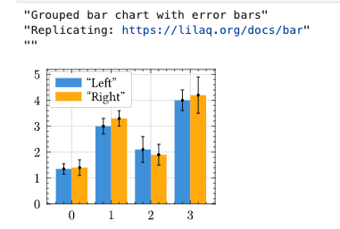
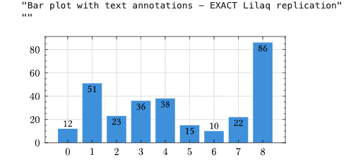
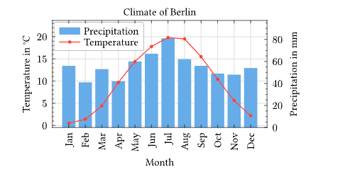
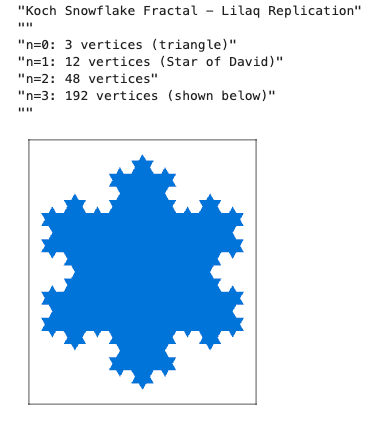
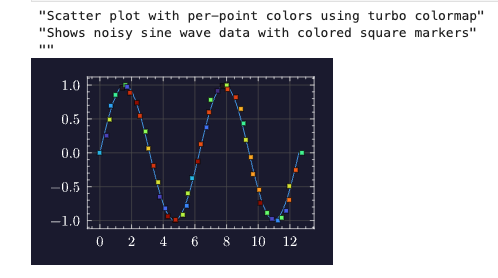
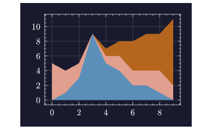

# Jupyter Notebook

Kleis provides Jupyter kernel support, allowing you to write and execute Kleis code in Jupyter notebooks. This is ideal for:


*JupyterLab launcher with Kleis and Kleis Numeric kernels*

- **Interactive exploration** of mathematical concepts
- **Teaching** mathematical foundations
- **Documenting** proofs and derivations
- **Numerical computation** with LAPACK operations
- **Publication-quality plotting** with Lilaq/Typst integration

## Quick Start

```bash
cd kleis-notebook
./start-jupyter.sh
```

This will:
1. Create a Python virtual environment (if needed)
2. Install JupyterLab and the Kleis kernel
3. Launch JupyterLab in your browser

## Installation

### Prerequisites

1. **Python 3.8+** with pip
2. **Kleis binary** compiled with numerical features:

```bash
cd /path/to/kleis
export Z3_SYS_Z3_HEADER=/opt/homebrew/opt/z3/include/z3.h  # macOS Apple Silicon
cargo install --path . --features numerical
```

> **Note:** The `--features numerical` flag enables LAPACK operations for eigenvalues, SVD, matrix inversion, and more.

### Install the Kernel

```bash
cd kleis-notebook

# Option 1: Use the launcher script (recommended)
./start-jupyter.sh install

# Option 2: Manual installation
python3 -m venv venv
source venv/bin/activate
pip install -e .
pip install jupyterlab
python -m kleis_kernel.install
python -m kleis_kernel.install_numeric
```

## Using Kleis in Jupyter

### Creating a Notebook

1. Start JupyterLab: `./start-jupyter.sh`
2. Click **New Notebook**
3. Select **Kleis** or **Kleis Numeric** kernel

### Example: Defining a Group

```kleis
structure Group(G) {
    operation (*) : G × G → G
    element e : G
    
    axiom left_identity: ∀(a : G). e * a = a
    axiom right_identity: ∀(a : G). a * e = a
    axiom associativity: ∀(a b c : G). (a * b) * c = a * (b * c)
}
```

### Example: Testing Properties

```kleis
example "group identity" {
    assert(e * e = e)
}
```

Output:
```
✅ group identity passed
```

### Example: Numerical Computation

```kleis
eigenvalues([[1.0, 2.0], [3.0, 4.0]])
```

Output:
```
[-0.3722813232690143, 5.372281323269014]
```

## REPL Commands

Use REPL commands directly in notebook cells:

| Command | Description | Example |
|---------|-------------|---------|
| `:type <expr>` | Show inferred type | `:type 1 + 2` |
| `:eval <expr>` | Evaluate concretely | `:eval det([[1,2],[3,4]])` |
| `:verify <expr>` | Verify with Z3 | `:verify ∀(x : ℝ). x + 0 = x` |
| `:ast <expr>` | Show parsed AST | `:ast sin(x)` |
| `:env` | Show session context | `:env` |
| `:load <file>` | Load .kleis file | `:load stdlib/prelude.kleis` |

## Jupyter Magic Commands

| Command | Description |
|---------|-------------|
| `%reset` | Clear session context (forget all definitions) |
| `%context` | Show accumulated definitions |
| `%version` | Show Kleis and kernel versions |

## Numerical Operations

When Kleis is compiled with `--features numerical`, these LAPACK-powered operations are available:

### Eigenvalue Decomposition

```kleis
// Compute eigenvalues
eigenvalues([[4.0, 2.0], [1.0, 3.0]])
// → [5.0, 2.0]

// Full decomposition (eigenvalues + eigenvectors)
eig([[4.0, 2.0], [1.0, 3.0]])
// → [[5.0, 2.0], [[0.894, 0.707], [-0.447, 0.707]]]
```

### Matrix Factorizations

```kleis
// Singular Value Decomposition
svd([[1.0, 2.0], [3.0, 4.0], [5.0, 6.0]])
// → (U, S, Vt)

// QR Decomposition
qr([[1.0, 2.0], [3.0, 4.0]])
// → (Q, R)

// Cholesky Decomposition (symmetric positive definite)
cholesky([[4.0, 2.0], [2.0, 5.0]])
// → Lower triangular L where A = L * L^T

// Schur Decomposition
schur([[1.0, 2.0], [3.0, 4.0]])
// → (U, T, eigenvalues)
```

### Linear Algebra

```kleis
// Matrix inverse
inv([[1.0, 2.0], [3.0, 4.0]])
// → Matrix(2, 2, [-2, 1, 1.5, -0.5])

// Determinant
det([[1.0, 2.0], [3.0, 4.0]])
// → -2

// Solve linear system Ax = b
solve([[3.0, 1.0], [1.0, 2.0]], [9.0, 8.0])
// → [2.0, 3.0]

// Matrix rank
rank([[1.0, 2.0, 3.0], [4.0, 5.0, 6.0], [7.0, 8.0, 9.0]])
// → 2

// Condition number
cond([[1.0, 2.0], [3.0, 4.0]])
// → 14.933...

// Matrix norms
norm([[1.0, 2.0], [3.0, 4.0]])
// → Frobenius norm
```

### Matrix Exponential

```kleis
// e^A (useful for differential equations)
expm([[0.0, 1.0], [-1.0, 0.0]])
// → rotation matrix
```

## Built-in Functions Reference

> **Important:** These functions perform **concrete numeric computation**. They cannot be used in symbolic contexts such as `structure` definitions, `axiom` declarations, or abstract proofs. They are designed for interactive exploration, plotting, and numerical analysis.

### Math Functions

| Function | Description | Example |
|----------|-------------|---------|
| `sin(x)` | Sine (radians) | `sin(3.14159)` → `0.0` |
| `cos(x)` | Cosine (radians) | `cos(0)` → `1.0` |
| `sqrt(x)` | Square root | `sqrt(2)` → `1.414...` |
| `pi()` | π constant | `pi()` → `3.14159...` |
| `radians(deg)` | Degrees to radians | `radians(180)` → `3.14159...` |
| `mod(a, b)` | Modulo operation | `mod(7, 3)` → `1` |

### Sequence Generation

| Function | Description | Example |
|----------|-------------|---------|
| `range(n)` | Integers 0 to n-1 | `range(5)` → `[0, 1, 2, 3, 4]` |
| `range(start, end)` | Integers start to end-1 | `range(2, 5)` → `[2, 3, 4]` |
| `linspace(start, end)` | 50 evenly spaced values | `linspace(0, 1)` → `[0, 0.02, ...]` |
| `linspace(start, end, n)` | n evenly spaced values | `linspace(0, 1, 5)` → `[0, 0.25, 0.5, 0.75, 1]` |

### Random Number Generation

These use a deterministic pseudo-random number generator (LCG) for reproducibility.

| Function | Description | Example |
|----------|-------------|---------|
| `random(n)` | n uniform random values in [0,1] | `random(5)` → `[0.25, 0.08, ...]` |
| `random(n, seed)` | With explicit seed | `random(5, 42)` → reproducible |
| `random_normal(n)` | n values from N(0,1) | `random_normal(5)` |
| `random_normal(n, seed)` | With explicit seed | `random_normal(5, 33)` |
| `random_normal(n, seed, scale)` | N(0, scale) | `random_normal(50, 33, 0.1)` |

### Vector Operations

| Function | Description | Example |
|----------|-------------|---------|
| `vec_add(a, b)` | Element-wise addition | `vec_add([1,2,3], [4,5,6])` → `[5, 7, 9]` |

### List Manipulation

| Function | Description | Example |
|----------|-------------|---------|
| `list_map(f, xs)` | Apply f to each element | `list_map(λ x . x*2, [1,2,3])` → `[2, 4, 6]` |
| `list_filter(p, xs)` | Keep elements where p(x) is true | `list_filter(λ x . x > 1, [1,2,3])` → `[2, 3]` |
| `list_fold(f, init, xs)` | Left fold/reduce | `list_fold(λ a b . a + b, 0, [1,2,3])` → `6` |
| `list_zip(xs, ys)` | Pair corresponding elements | `list_zip([1,2], ["a","b"])` → `[Pair(1,"a"), ...]` |
| `list_nth(xs, i)` | Element at index i (0-based) | `list_nth([10,20,30], 1)` → `20` |
| `list_length(xs)` | Number of elements | `list_length([1,2,3])` → `3` |
| `list_concat(xs, ys)` | Concatenate two lists | `list_concat([1,2], [3,4])` → `[1, 2, 3, 4]` |
| `list_flatten(xss)` | Flatten nested lists | `list_flatten([[1,2], [3,4]])` → `[1, 2, 3, 4]` |
| `list_slice(xs, start, end)` | Sublist [start, end) | `list_slice([0,1,2,3,4], 1, 3)` → `[1, 2]` |
| `list_rotate(xs, n)` | Rotate left by n | `list_rotate([1,2,3,4], 1)` → `[2, 3, 4, 1]` |

### Pair Operations

| Function | Description | Example |
|----------|-------------|---------|
| `Pair(a, b)` | Create a pair/tuple | `Pair(1, "x")` |
| `fst(p)` | First element of pair | `fst(Pair(1, 2))` → `1` |
| `snd(p)` | Second element of pair | `snd(Pair(1, 2))` → `2` |

### Why Numeric-Only?

These functions are implemented in Rust for performance and produce concrete values:

```kleis
// ✅ Works: Concrete computation
let xs = linspace(0, 6.28, 10)
let ys = list_map(λ x . sin(x), xs)
diagram(plot(xs, ys))

// ❌ Does NOT work: Cannot use in axioms
structure MyStructure(T) {
    axiom bad: sin(x) = cos(x - pi()/2)  // ERROR: sin/cos/pi are numeric
}
```

For symbolic mathematics, define your own abstract operations:

```kleis
// ✅ Correct: Define sin symbolically
structure Trigonometry(T) {
    operation sin : T → T
    operation cos : T → T
    constant π : T
    
    axiom shift: ∀(x : T). sin(x) = cos(x - π/2)
}
```

## Matrix Syntax

Matrices can be specified using nested list syntax:

```kleis
// 2×2 matrix (row-major order)
[[1, 2], [3, 4]]

// 3×3 identity matrix concept
[[1, 0, 0], [0, 1, 0], [0, 0, 1]]

// Column vector as 3×1 matrix
[[1], [2], [3]]

// Row vector as 1×3 matrix
[[1, 2, 3]]
```

## Session Persistence

Definitions persist across cells within a session:

**Cell 1:**
```kleis
define square(x) = x * x
```

**Cell 2:**
```kleis
example "use square" {
    assert(square(3) = 9)
}
```

Output:
```
✅ use square passed
```

Use `%reset` to clear all definitions and start fresh.

## Tips for Effective Notebooks

1. **Start with imports and definitions** at the top
2. **Use example blocks** for testable assertions
3. **Use `:eval`** for quick numerical calculations
4. **Use `:verify`** for Z3-backed proofs
5. **Document with markdown cells** between code
6. **Save frequently** - Kleis notebooks are standard `.ipynb` files

## Troubleshooting

### "kleis binary not found"

Install Kleis with:
```bash
cd /path/to/kleis
export Z3_SYS_Z3_HEADER=/opt/homebrew/opt/z3/include/z3.h
cargo install --path . --features numerical
```

### Numerical operations return symbolic expressions

Make sure Kleis was compiled with `--features numerical`:
```bash
cargo install --path . --features numerical
```

### Kernel dies unexpectedly

Check the terminal for error messages. Common causes:
- Z3 timeout on complex verification
- Memory issues with large matrices

### Imports fail (stdlib not found)

When running Jupyter from a directory other than the Kleis project root, stdlib imports may fail:

```
Error: Cannot find file: stdlib/prelude.kleis
```

**Solution:** Set the `KLEIS_ROOT` environment variable to point to your Kleis installation:

```bash
export KLEIS_ROOT=/path/to/kleis
jupyter lab
```

Or add it to your shell profile (`~/.bashrc`, `~/.zshrc`):

```bash
export KLEIS_ROOT="$HOME/git/cee/kleis"
```

The Kleis kernel automatically searches for stdlib in:
1. `$KLEIS_ROOT/stdlib/` (if KLEIS_ROOT is set)
2. Current working directory
3. Parent directories (up to 10 levels)

### Unicode input

Use standard Kleis Unicode shortcuts:
- `\forall` → `∀`
- `\exists` → `∃`
- `\in` → `∈`
- `\R` → `ℝ`
- `\N` → `ℕ`
- `\Z` → `ℤ`

## Example Notebook

Here's a complete example exploring matrix properties:

**Cell 1: Setup**
```kleis
// Define a 2×2 matrix
let A = [[1.0, 2.0], [3.0, 4.0]]
```

**Cell 2: Basic properties**
```kleis
det(A)        // → -2
trace(A)      // → 5 (not yet implemented, use 1+4)
```

**Cell 3: Eigenvalues**
```kleis
eigenvalues(A)
// → [-0.372..., 5.372...]
```

**Cell 4: Verify Cayley-Hamilton**
```kleis
// A matrix satisfies its characteristic polynomial
// For 2×2: A² - trace(A)*A + det(A)*I = 0
// This is verified numerically by the eigenvalue product
```

**Cell 5: Matrix inverse**
```kleis
let Ainv = inv(A)
// Verify: A * Ainv should be identity
// (Matrix multiplication coming soon!)
```

## Plotting

Kleis integrates with **Lilaq** (Typst's plotting library) to generate publication-quality plots directly in Jupyter notebooks. The API mirrors Lilaq's compositional design, making it easy to create complex visualizations.

### Requirements

- **Typst CLI** must be installed: `brew install typst` (macOS) or see [typst.app](https://typst.app)
- Lilaq 0.5.0+ is automatically imported

### Compositional API

Kleis uses a compositional plotting API where:
- Individual functions (`plot`, `scatter`, `bar`, etc.) create **PlotElement** objects
- The `diagram()` function combines elements and renders to SVG
- Named arguments (`key = value`) configure options

```kleis
diagram(
    plot(xs, ys, color = "blue"),
    scatter(xs, ys, mark = "s"),
    bar(xs, heights, label = "Data"),
    title = "My Chart",
    xlabel = "X-axis",
    theme = "moon"
)
```

### Plot Functions

| Function | Description | Example |
|----------|-------------|---------|
| `plot(x, y, ...)` | Line plot | `plot([0,1,2], [0,1,4], color = "blue")` |
| `scatter(x, y, ...)` | Scatter with colormaps | `scatter(x, y, colors = vals, map = "turbo")` |
| `bar(x, heights, ...)` | Vertical bars | `bar([1,2,3], [10,25,15], label = "Data")` |
| `hbar(y, widths, ...)` | Horizontal bars | `hbar([1,2,3], [10,25,15])` |
| `stem(x, y)` | Stem plot | `stem([0,1,2], [0,1,1])` |
| `fill_between(x, y, ...)` | Area under curve | `fill_between(x, y1, y2 = y2)` |
| `stacked_area(x, y1, y2, ...)` | Stacked areas | `stacked_area(x, y1, y2, y3)` |
| `boxplot(d1, d2, ...)` | Box and whisker | `boxplot([1,2,3], [4,5,6])` |
| `heatmap(matrix)` | 2D color grid | `heatmap([[1,2],[3,4]])` |
| `contour(matrix)` | Contour lines | `contour([[1,2],[3,4]])` |
| `path(points, ...)` | Arbitrary polygon | `path(pts, fill = "blue", closed = true)` |
| `place(x, y, text, ...)` | Text annotation | `place(1, 5, "Peak", align = "top")` |
| `yaxis(elements, ...)` | Secondary y-axis | `yaxis(bar(...), position = "right")` |
| `xaxis(...)` | Secondary x-axis | `xaxis(position = "top", functions = ...)` |

### Data Generation Functions

| Function | Description | Example |
|----------|-------------|---------|
| `linspace(start, end, n)` | Evenly spaced values | `linspace(0, 6.28, 50)` |
| `range(n)` | Integers 0 to n-1 | `range(10)` |
| `random(n, seed)` | Uniform random [0,1] | `random(50, 42)` |
| `random_normal(n, seed, scale)` | Normal distribution | `random_normal(50, 33, 0.1)` |
| `vec_add(a, b)` | Element-wise addition | `vec_add(xs, noise)` |

### Example: Grouped Bar Chart with Error Bars



```kleis
let xs = [0, 1, 2, 3]
let ys1 = [1.35, 3, 2.1, 4]
let ys2 = [1.4, 3.3, 1.9, 4.2]
let yerr1 = [0.2, 0.3, 0.5, 0.4]
let yerr2 = [0.3, 0.3, 0.4, 0.7]

let xs_left = list_map(λ x . x - 0.2, xs)
let xs_right = list_map(λ x . x + 0.2, xs)

diagram(
    bar(xs, ys1, offset = -0.2, width = 0.4, label = "Left"),
    bar(xs, ys2, offset = 0.2, width = 0.4, label = "Right"),
    plot(xs_left, ys1, yerr = yerr1, color = "black", stroke = "none"),
    plot(xs_right, ys2, yerr = yerr2, color = "black", stroke = "none"),
    width = 5,
    legend_position = "left + top"
)
```

### Example: Bar Chart with Dynamic Annotations



```kleis
let xs = [0, 1, 2, 3, 4, 5, 6, 7, 8]
let ys = [12, 51, 23, 36, 38, 15, 10, 22, 86]

// Dynamic annotations using list_map and conditionals
let annotations = list_map(λ p . 
    let x = fst(p) in
    let y = snd(p) in
    let align = if y > 12 then "top" else "bottom" in
    place(x, y, y, align = align, padding = "0.2em")
, list_zip(xs, ys))

diagram(
    bar(xs, ys),
    annotations,
    width = 9,
    xaxis_subticks = "none"
)
```

### Example: Climograph with Twin Axes



```kleis
let months = ["Jan", "Feb", "Mar", "Apr", "May", "Jun", 
              "Jul", "Aug", "Sep", "Oct", "Nov", "Dec"]
let precipitation = [56, 41, 53, 42, 60, 67, 81, 62, 56, 49, 48, 54]
let temperature = [0.5, 1.4, 4.4, 9.7, 14.4, 17.8, 19.8, 19.5, 15.5, 10.4, 5.6, 2.2]
let xs = range(12)

diagram(
    yaxis(
        bar(xs, precipitation, fill = "blue.lighten(40%)", label = "Precipitation"),
        position = "right",
        axis_label = "Precipitation in mm"
    ),
    plot(xs, temperature, label = "Temperature", color = "red", stroke = "1pt", mark_size = 6),
    width = 8,
    title = "Climate of Berlin",
    ylabel = "Temperature in °C",
    xlabel = "Month",
    xaxis_ticks = months,
    xaxis_tick_rotate = -90,
    xaxis_subticks = "none"
)
```

### Example: Koch Snowflake Fractal



```kleis
// Complex number operations
define complex_add(c1, c2) = Pair(fst(c1) + fst(c2), snd(c1) + snd(c2))
define complex_sub(c1, c2) = Pair(fst(c1) - fst(c2), snd(c1) - snd(c2))
define complex_mul(c1, c2) = Pair(
    (fst(c1)*fst(c2)) - (snd(c1)*snd(c2)),
    (fst(c1)*snd(c2)) + (snd(c1)*fst(c2))
)

define triangle_vertex(angle) = Pair(cos(radians(angle)), sin(radians(angle)))
define base_triangle() = [triangle_vertex(90), triangle_vertex(210), triangle_vertex(330)]

define koch_edge(p1, p2) = 
    let d = complex_sub(p2, p1) in
    [p1, complex_add(p1, complex_mul(d, Pair(1/3, 0))),
     complex_add(p1, complex_mul(d, Pair(0.5, 0 - sqrt(3)/6))),
     complex_add(p1, complex_mul(d, Pair(2/3, 0)))]

define koch_iter(pts) = 
    let n = list_length(pts) in
    list_flatten(list_map(λ i . 
        koch_edge(list_nth(pts, i), list_nth(pts, mod(i + 1, n)))
    , range(n)))

let n0 = base_triangle()
let n3 = koch_iter(koch_iter(koch_iter(n0)))  // 192 vertices

diagram(
    path(n3, fill = "blue", closed = true),
    width = 6, height = 7,
    xaxis_ticks_none = true,
    yaxis_ticks_none = true
)
```

### Example: Scatter Plot with Colormap



```kleis
let xs = linspace(0, 12.566370614, 50)  // 0 to 4π
let ys = list_map(lambda x . sin(x), xs)
let noise = random_normal(50, 33, 0.1)
let xs_noisy = vec_add(xs, noise)
let colors = random(50, 42)

diagram(
    plot(xs, ys, mark = "none"),
    scatter(xs_noisy, ys, 
        mark = "s",
        colors = colors,
        map = "turbo",
        stroke = "0.5pt + black"
    ),
    theme = "moon"
)
```

### Example: Stacked Area Chart



```kleis
let xs = [0, 1, 2, 3, 4, 5, 6, 7, 8, 9]
let y1 = [0, 1, 3, 9, 5, 4, 2, 2, 1, 0]
let y2 = [5, 3, 2, 0, 1, 2, 2, 2, 3, 2]
let y3 = [0, 0, 0, 0, 1, 2, 4, 5, 5, 9]

diagram(
    stacked_area(xs, y1, y2, y3),
    theme = "moon"
)
```

### Themes

Kleis supports Lilaq's built-in themes:

| Theme | Description |
|-------|-------------|
| `schoolbook` | Math textbook style with axes at origin |
| `moon` | Dark theme for presentations |
| `ocean` | Blue-tinted theme |
| `misty` | Soft, muted colors |
| `skyline` | Clean, modern look |

```kleis
diagram(
    plot(xs, ys),
    theme = "moon"
)
```

### Axis Customization

| Option | Description | Example |
|--------|-------------|---------|
| `xlim`, `ylim` | Axis limits | `xlim = [-6.28, 6.28]` |
| `xaxis_tick_unit` | Tick spacing unit | `xaxis_tick_unit = 3.14159` |
| `xaxis_tick_suffix` | Tick label suffix | `xaxis_tick_suffix = "pi"` |
| `xaxis_tick_rotate` | Rotate labels | `xaxis_tick_rotate = -90` |
| `xaxis_ticks_none` | Hide ticks | `xaxis_ticks_none = true` |

### Complete Example Notebook

**Cell 1: Import stdlib**
```kleis
import "stdlib/prelude.kleis"
```

**Cell 2: Generate data with linspace**
```kleis
let xs = linspace(0, 6.28, 50)
let ys = list_map(lambda x . sin(x), xs)
```

**Cell 3: Plot with theme**
```kleis
diagram(
    plot(xs, ys, color = "blue", stroke = "2pt"),
    title = "Sine Wave",
    xlabel = "x",
    ylabel = "sin(x)",
    theme = "moon"
)
```

### Logarithmic Scales

For exponential or power-law data, use logarithmic scales:

```kleis
// Semi-log plot (linear x, logarithmic y)
diagram(
    plot([0, 1, 2, 3, 4], [1, 10, 100, 1000, 10000]),
    title = "Exponential Growth",
    yscale = "log"   // "linear", "log", or "symlog"
)

// Log-log plot (both axes logarithmic)
diagram(
    plot([1, 10, 100, 1000], [1, 100, 10000, 1000000]),
    title = "Power Law",
    xscale = "log",
    yscale = "log"
)
```

Available scales:
- `"linear"` - Default linear scale
- `"log"` - Logarithmic scale (base 10)
- `"symlog"` - Symmetric log (linear near 0, log elsewhere; handles negative values)

### Future Enhancements

See the [Plotting Roadmap](../../../PLOTTING_ROADMAP.md) for planned features:
- Function plotting (`fplot`)
- 3D surface plots
- Polar plots

## Next Steps

- Explore the [REPL chapter](./12-repl.md) for more interactive features
- See [Matrices](./19-matrices.md) for symbolic matrix operations
- Check [Z3 Verification](./11-z3-verification.md) for formal proofs

