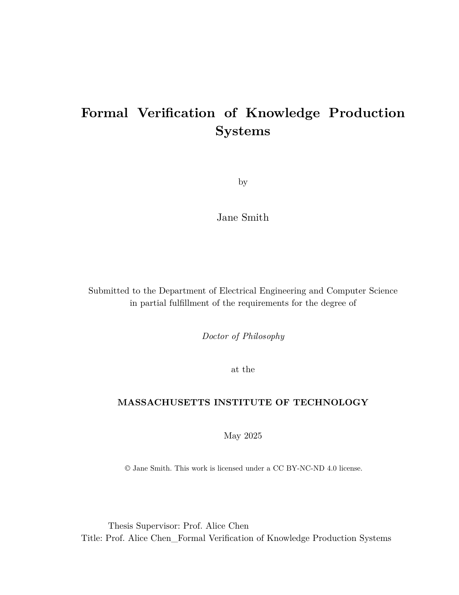
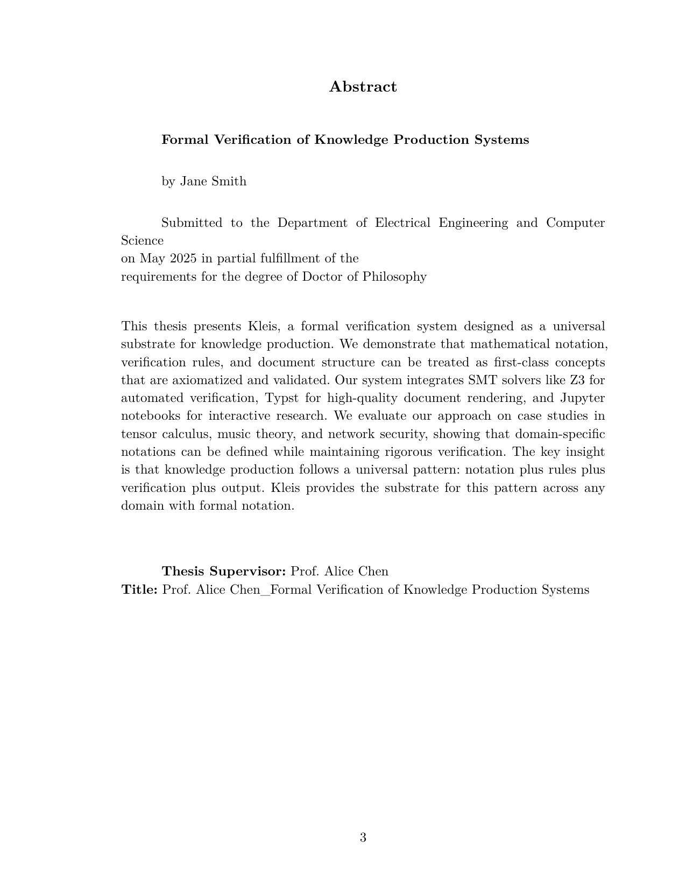
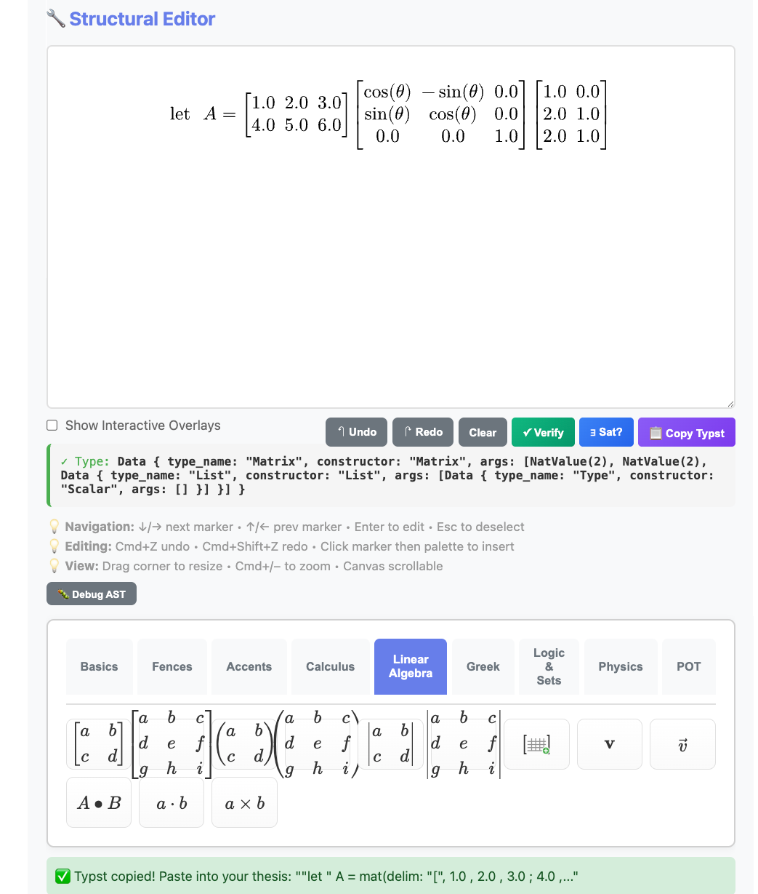

# Creating Documents with Kleis

Kleis provides a complete document generation system for creating publication-quality theses, dissertations, and papers. Unlike traditional approaches where documents are separate from code, in Kleis **your document IS a program**.

## The Philosophy: Document = Program

Traditional academic writing separates:
- **Code** (Jupyter notebooks, Python scripts)
- **Equations** (LaTeX, copy-pasted)
- **Plots** (matplotlib, exported as images)
- **Document** (Word, LaTeX, Google Docs)

This separation causes problems:
- Copy-paste errors between code and paper
- Equations that can't be re-edited
- Plots that can't be regenerated
- No verification of mathematical claims

**Kleis unifies everything into a single program:**

```
┌─────────────────────────────────────────────────────────────┐
│               Your Document (.kleis file)                   │
├─────────────────────────────────────────────────────────────┤
│  Template Import   │ import "stdlib/templates/mit_thesis"   │
│  Metadata          │ Title, author, date, abstract          │
│  Equations         │ MITEquation("label", "$ E = mc^2 $")   │
│  Diagrams          │ MITDiagram("fig1", "caption", code)    │
│  Tables            │ MITTable("tab1", "caption", typst)     │
│  Chapters          │ MITChapter(1, "Introduction", "...")   │
│  Compile Function  │ compile_mit_thesis(my_thesis)          │
└─────────────────────────────────────────────────────────────┘
                              ↓
                   kleis test my_thesis.kleis
                              ↓
                        Typst Output
                              ↓
                   typst compile → PDF
```

## Quick Start

### Prerequisites

1. **Kleis** compiled and in PATH
2. **Typst** for PDF generation: `brew install typst`

### Your First Document (5 minutes)

Create a file `my_paper.kleis`:

```kleis
import "stdlib/templates/arxiv_paper.kleis"

// Define your paper
define my_paper = arxiv_paper(
    "My Amazing Research",                    // title
    ["Alice Smith", "Bob Jones"],             // authors
    ["MIT", "Stanford"],                      // affiliations
    "We present groundbreaking results...",   // abstract
    ["machine learning", "verification"],     // keywords
    [
        ArxivSection("Introduction", "We begin by..."),
        ArxivEquation("eq:main", "$ f(x) = x^2 + 1 $"),
        ArxivSection("Methods", "Our approach uses..."),
        ArxivSection("Conclusion", "We have shown...")
    ]
)

// Compile and output
example "compile" {
    let typst = compile_arxiv_paper(my_paper)
    out(typst)
}
```

Generate PDF:

```bash
kleis test my_paper.kleis > my_paper.typ
typst compile my_paper.typ my_paper.pdf
open my_paper.pdf
```

**That's it!** Your document is a Kleis program.

## Available Templates

Kleis includes three professionally-styled templates:

| Template | File | Use Case |
|----------|------|----------|
| **MIT Thesis** | `stdlib/templates/mit_thesis.kleis` | MIT PhD dissertations |
| **UofM Rackham** | `stdlib/templates/uofm_thesis.kleis` | University of Michigan dissertations |
| **arXiv Paper** | `stdlib/templates/arxiv_paper.kleis` | arXiv preprints, conference papers |

Each template includes:
- Proper page margins and fonts per institution guidelines
- Title page, abstract, table of contents
- Chapter/section formatting
- Figure, table, and equation support
- Bibliography formatting
- Appendices

### Template Gallery

**MIT Thesis:**



**University of Michigan Dissertation:**


**arXiv Paper:**


## MIT Thesis Template

The MIT thesis template follows the official [MIT Libraries thesis specifications](https://libraries.mit.edu/distinctive-collections/thesis-specs/).

### Document Structure

```kleis
import "stdlib/templates/mit_thesis.kleis"

// Define thesis metadata
define my_thesis = mit_thesis(
    "Formal Verification of Knowledge Production Systems",  // title
    "Jane Smith",                                            // author
    "Department of EECS",                                    // department
    "May 2026",                                              // date
    PhD,                                                     // degree: SB, SM, or PhD
    "This thesis presents Kleis, a formal verification...", // abstract
    "Prof. Alice Chen",                                      // supervisor
    "Professor of Computer Science",                         // supervisor title
    "I thank my advisor...",                                 // acknowledgments
    "To my family...",                                       // dedication
    all_elements                                             // document content
)
```

### Content Elements

```kleis
// Chapters
define ch1 = MITChapter(1, "Introduction", "Knowledge production relies on...")

// Sections within chapters
define sec1 = MITSection("Motivation", "The need for formal verification...")

// Subsections
define subsec1 = MITSubsection("Historical Context", "Early work in...")

// Equations
define eq_einstein = MITEquation("eq:einstein", "$ E = m c^2 $")

// Figures (with Typst code)
define fig_arch = MITFigure("fig:arch", "System architecture",
    "#rect(width: 80%, height: 3cm, fill: luma(240))[Architecture diagram]")

// Diagrams using NATIVE KLEIS data
define iterations = [1.0, 2.0, 3.0, 4.0, 5.0]
define accuracy = [10.0, 25.0, 40.0, 55.0, 70.0]
define fig_perf = MITDiagram("fig:perf", "Performance comparison",
    export_typst_fragment(plot(iterations, accuracy, mark = "o"),
        xlabel = "Iterations", ylabel = "Accuracy (%)"))

// Tables using NATIVE KLEIS data
define headers = ["Method", "Accuracy", "Runtime"]
define rows = [["Baseline", "72%", "1.2s"], ["Ours", "89%", "0.8s"]]
define tab_results = MITTable("tab:results", "Experimental results",
    table_typst(headers, rows))

// References
define ref1 = MITReference("demoura2008", 
    "de Moura, L. Z3: An Efficient SMT Solver. TACAS 2008.")

// Appendices
define app_a = MITAppendix("Proofs", "Detailed proofs of theorems...")

// Acknowledgments and dedication
define ack = MITAcknowledgments("I thank my advisor...")
define ded = MITDedication("To my family...")
```

### Complete MIT Thesis Example

See the full working example: `examples/documents/jane_smith_thesis.kleis`

```kleis
import "stdlib/prelude.kleis"
import "stdlib/templates/mit_thesis.kleis"

// ============================================================================
// JANE SMITH'S PHD THESIS
// ============================================================================

// Chapter 1: Introduction
define ch1 = MITChapter(1, "Introduction", 
    "Knowledge production in science relies on precise notation and rigorous 
    verification. Traditional approaches separate these concerns...")

// Key equation
define eq_einstein = MITEquation("eq:einstein", "$ E = m c^2 $")

// Performance diagram using NATIVE KLEIS data
define loc = [100.0, 500.0, 1000.0, 5000.0, 10000.0]
define kleis_time = [0.1, 0.3, 0.5, 1.2, 2.1]
define other_time = [0.2, 0.8, 2.0, 12.0, 45.0]

define fig_performance = MITDiagram("fig:perf", "Type inference performance",
    export_typst_fragment(plot(loc, kleis_time, mark = "o", label = "Kleis"),
        xlabel = "Lines of Code", ylabel = "Time (seconds)"))

// Results table using NATIVE KLEIS data
define feature_headers = ["Feature", "Kleis", "Lean", "Coq"]
define feature_rows = [
    ["SMT Integration", "✓", "Partial", "✗"],
    ["Type Inference", "✓", "✓", "✓"],
    ["Typst Export", "✓", "✗", "✗"]
]
define table_features = MITTable("tab:features", "Feature comparison",
    table_typst(feature_headers, feature_rows))

// Assemble all elements in order
define all_elements = [
    ack,           // Acknowledgments (front matter)
    ded,           // Dedication (front matter)
    ch1,           // Chapter 1
    eq_einstein,
    fig_performance,
    ch2,           // Chapter 2
    table_features,
    ch3,           // Chapter 3
    ref1, ref2,    // References
    app_a          // Appendix
]

// Create the thesis
define my_thesis = mit_thesis_full(
    "Formal Verification of Knowledge Production Systems",
    "Jane Smith",
    "Department of Electrical Engineering and Computer Science",
    "May 2026",
    PhD,
    "This thesis presents Kleis, a formal verification system...",
    "Prof. Alice Chen",
    "Professor of Computer Science",
    "I thank my advisor Prof. Chen for her guidance...",
    "To my parents, who taught me to question everything.",
    all_elements
)

// Compile to Typst
example "compile" {
    let typst = compile_mit_thesis(my_thesis)
    out(typst)
}
```

### What the MIT Template Produces

The compiled thesis includes:

1. **Title Page** - Centered title, author, department, degree, date
2. **Signature Page** - For PhD: supervisor signature block
3. **Abstract** - Formatted per MIT specifications
4. **Acknowledgments** - Optional dedication to advisors, family
5. **Dedication** - Optional short dedication
6. **Table of Contents** - Auto-generated from chapters
7. **List of Figures** - Auto-generated from figures
8. **List of Tables** - Auto-generated from tables
9. **Chapters** - Numbered chapters with sections
10. **References** - Bibliography section
11. **Appendices** - Lettered appendices (A, B, C...)

**Table of Contents (auto-generated):**



**Chapter Content with Equations and Diagrams:**


## University of Michigan Rackham Template

The UofM template follows [Rackham Graduate School formatting guidelines](https://rackham.umich.edu/navigating-your-degree/formatting-guidelines/).

### Document Structure

```kleis
import "stdlib/templates/uofm_thesis.kleis"

// Committee members
define committee = [
    committee_member("Prof. Alice Chen", "Computer Science"),
    committee_member("Prof. Bob Smith", "Mathematics"),
    committee_member("Prof. Carol Davis", "Statistics")
]

// Define dissertation
define my_dissertation = umich_dissertation(
    "Deep Learning Theory and Applications",      // title
    "Alex Chen",                                  // author
    "Computer Science and Engineering",           // program
    "2026",                                       // year
    PhD,                                          // degree
    "This dissertation investigates...",          // abstract
    "Prof. Alice Chen",                           // committee chair
    "Computer Science and Engineering",           // chair affiliation
    committee,                                    // committee list
    "achen@umich.edu",                           // email
    "0000-0001-2345-6789",                       // ORCID
    "I thank the Rackham Graduate School...",    // acknowledgments
    "To my mentors...",                          // dedication
    "This work began as...",                     // preface
    all_elements                                 // content
)
```

### UofM-Specific Features

- **Double spacing** throughout (Rackham requirement)
- **Identifier page** with ORCID and email
- **Committee page** with full committee list
- **Preface** section (optional)
- **2-inch top margin** on chapter openings
- **Roman numerals** for front matter pages

### Complete UofM Example

See: `examples/documents/alex_chen_dissertation.kleis`

## arXiv Paper Template

The arXiv template follows common academic paper conventions for preprints.

### Document Structure

```kleis
import "stdlib/templates/arxiv_paper.kleis"

define my_paper = arxiv_paper_full(
    "Attention Is All You Need",                          // title
    ["Ashish Vaswani", "Noam Shazeer", "Niki Parmar"],   // authors
    ["Google Brain", "Google Brain", "Google Research"], // affiliations
    "The dominant sequence transduction models...",       // abstract
    ["transformers", "attention", "neural networks"],    // keywords
    all_elements                                          // content
)
```

### arXiv Content Elements

```kleis
// Sections (no chapters in papers)
ArxivSection("Introduction", "Recent advances in...")
ArxivSection("Related Work", "Prior work includes...")

// Equations
ArxivEquation("eq:attention", "$ \\text{Attention}(Q, K, V) = \\text{softmax}(QK^T / \\sqrt{d_k})V $")

// Algorithms (using Typst's algo package)
ArxivAlgorithm("alg:train", "Training procedure", "
#import \"@preview/algorithmic:0.1.0\"
#algorithmic.algorithm({
  algorithmic.For(cond: [epoch in 1..N])[
    algorithmic.For(cond: [batch in data])[
      Compute loss and update
    ]
  ]
})
")

// Figures, tables, diagrams (same as MIT)
ArxivFigure("fig:model", "Model architecture", "...")
ArxivTable("tab:results", "Experimental results", "...")
ArxivDiagram("fig:loss", "Training loss", "...")

// Acknowledgments
ArxivAcknowledgments("We thank the Google Brain team...")

// References
ArxivReference("vaswani2017", "Vaswani et al. Attention Is All You Need. NeurIPS 2017.")

// Appendices
ArxivAppendix("Implementation Details", "We used PyTorch...")
```

### Complete arXiv Example

See: `examples/documents/sample_arxiv_paper.kleis`

## Diagrams and Plots

Kleis integrates with the [Lilaq](https://typst.app/universe/package/lilaq) plotting library for creating beautiful diagrams directly in your document.

### Native Kleis Data (Recommended)

The most powerful approach uses native Kleis lists with `export_typst_fragment()`:

```kleis
// Define your data as Kleis lists
define epochs = [1.0, 2.0, 3.0, 4.0, 5.0]
define accuracy = [10.0, 25.0, 45.0, 70.0, 90.0]

// Create a plot using Kleis's native plot() function
define my_plot = plot(epochs, accuracy, mark = "o", label = "Training")

// Convert to Typst code for embedding in a figure
define typst_code = export_typst_fragment(my_plot,
    title = "Model Performance",
    xlabel = "Epoch",
    ylabel = "Accuracy (%)"
)

// Use in your thesis/paper
define fig_training = MITDiagram("fig:training", "Training curves", typst_code)
```

**Why use native data?**
- Your data is Kleis—it can be computed, verified, and reused
- No manual Typst syntax errors
- Data can flow from experiments to figures seamlessly
- Easier to update when results change

### Available Plot Functions

| Function | Description |
|----------|-------------|
| `plot(xs, ys)` | Line plot |
| `scatter(xs, ys)` | Scatter plot |
| `bar(xs, heights)` | Vertical bar chart |
| `hbar(xs, widths)` | Horizontal bar chart |

Each function accepts optional parameters: `label`, `mark`, `stroke`, etc.

### Example: Complete Workflow

```kleis
// Raw experimental data
define x_data = [0.1, 0.5, 1.0, 5.0, 10.0, 25.0]
define method_a = [150.0, 120.0, 100.0, 80.0, 60.0, 40.0]
define method_b = [180.0, 140.0, 110.0, 85.0, 65.0, 45.0]

// Create plots
define plot_a = plot(x_data, method_a, mark = "o", label = "Method A")
define plot_b = plot(x_data, method_b, mark = "x", label = "Method B")

// Combine into diagram
define comparison_typst = export_typst_fragment(plot_a,
    title = "Performance Comparison",
    xlabel = "Problem Size",
    ylabel = "Time (ms)"
)

// Embed in thesis
define fig_comparison = MITDiagram("fig:comparison",
    "Performance comparison between methods",
    comparison_typst
)
```

### Fallback: Raw Typst Strings

For complex diagrams not yet supported by native functions, you can use raw Typst strings:

```kleis
define fig_complex = MITDiagram("fig:complex", "Complex diagram", "
import \"@preview/lilaq:0.5.0\" as lq
lq.diagram(
    lq.plot((1, 2, 3, 4), (10, 20, 35, 50), stroke: blue, mark: \"o\"),
    lq.plot((1, 2, 3, 4), (15, 30, 42, 55), stroke: red, mark: \"x\"),
    xlabel: \"Iteration\",
    ylabel: \"Value\"
)")
```

## Tables

### Native Kleis Data with `table_typst()` (Recommended)

The cleanest approach uses Kleis lists with `table_typst()`:

```kleis
// Define table data as Kleis lists
define headers = ["Method", "Accuracy", "F1 Score"]
define rows = [
    ["Baseline", "72.3%", "0.71"],
    ["Ours", "89.7%", "0.88"],
    ["SOTA", "87.1%", "0.86"]
]

// Generate Typst table code
define table_code = table_typst(headers, rows)

// Use in your thesis/paper
define tab_results = MITTable("tab:results", "Benchmark results", table_code)
```

**Why use `table_typst()`?**
- Data as Kleis lists—can be computed, imported, or transformed
- No manual Typst table syntax
- Rows can come from experiments or external data
- Easy to add/remove rows programmatically

### Example: Complete Workflow

```kleis
// Data from experiments
define methods = ["CNN", "ResNet", "Transformer", "Kleis-Net"]
define accuracy = ["72.3%", "85.1%", "87.4%", "89.7%"]
define f1_scores = ["0.71", "0.84", "0.86", "0.88"]
define memory = ["128 MB", "256 MB", "512 MB", "192 MB"]

// Build table from data
define headers = ["Method", "Accuracy", "F1", "Memory"]
define rows = [
    ["CNN", "72.3%", "0.71", "128 MB"],
    ["ResNet", "85.1%", "0.84", "256 MB"],
    ["Transformer", "87.4%", "0.86", "512 MB"],
    ["Kleis-Net", "89.7%", "0.88", "192 MB"]
]

define tab_comparison = MITTable("tab:comparison",
    "Comparison of deep learning methods",
    table_typst(headers, rows)
)
```

### Fallback: Raw Typst Strings

For styled tables, you can use raw Typst syntax:

```kleis
define tab_styled = MITTable("tab:styled", "Styled table", "
#table(
    columns: 4,
    stroke: 0.5pt,
    fill: (col, row) => if row == 0 { luma(230) },
    [Feature], [Kleis], [Lean], [Coq],
    [SMT], [✓], [Partial], [✗],
    [Types], [HM], [Dependent], [Dependent]
)")
```

## Equations

Equations use Typst math syntax (similar to LaTeX):

```kleis
// Simple equation
MITEquation("eq:simple", "$ x = \\frac{-b \\pm \\sqrt{b^2 - 4ac}}{2a} $")

// Multi-line equation
MITEquation("eq:multi", "$
\\nabla \\cdot E &= \\frac{\\rho}{\\epsilon_0} \\
\\nabla \\cdot B &= 0 \\
\\nabla \\times E &= -\\frac{\\partial B}{\\partial t} \\
\\nabla \\times B &= \\mu_0 J + \\mu_0 \\epsilon_0 \\frac{\\partial E}{\\partial t}
$")

// Inline math in text - just use $...$
MITSection("Methods", "A function $f: RR^n -> RR^m$ maps inputs to outputs.")

// Literal dollar sign - use \$
MITSection("Cost", "The price is \\$100 per unit.")
```

### Common Math Symbols

| Symbol | Typst | Example |
|--------|-------|---------|
| Fraction | `frac(a, b)` | $ \frac{a}{b} $ |
| Square root | `sqrt(x)` | $ \sqrt{x} $ |
| Summation | `sum_(i=0)^n` | $ \sum_{i=0}^n $ |
| Integral | `integral_a^b` | $ \int_a^b $ |
| Greek | `alpha, beta, gamma` | α, β, γ |
| Subscript | `x_i` | $ x_i $ |
| Superscript | `x^2` | $ x^2 $ |
| Partial | `partial` | ∂ |
| Nabla | `nabla` | ∇ |

### 💡 Tip: Use the Equation Editor

**You don't have to type Typst syntax manually!**

The Kleis Equation Editor is a visual, WYSIWYG tool for building equations. Instead of memorizing `frac(a, b)` or `mat(delim: "[", ...)`, you:

1. **Build visually** — Click buttons to create fractions, matrices, integrals
2. **See live preview** — The equation renders as you build (powered by Typst)
3. **Copy and paste** — Click "📋 Copy Typst" and paste into your thesis



*The Equation Editor showing a type-checked matrix multiplication with rotation matrix. The type indicator confirms: Matrix(2, 2, Scalar).*

**The workflow:**
```
Visual Editor → 📋 Copy Typst → Paste into thesis.kleis → PDF
```

**Example:** Building `let A = [1 2 3; 4 5 6] × R_z(θ) × [1 0; 2 1; 2 1]` takes seconds visually — versus minutes of typing and debugging Typst syntax.

> **Note:** The Equation Editor requires `kleis server` running:
> ```bash
> kleis server
> # Server running at http://localhost:3000
> ```
> Then open [http://localhost:3000](http://localhost:3000) in your browser. Full documentation coming in a future chapter.

## Generating PDFs

### Command Line

```bash
# Compile Kleis to Typst
kleis test my_thesis.kleis > my_thesis.typ

# Compile Typst to PDF  
typst compile my_thesis.typ my_thesis.pdf

# Open PDF (macOS)
open my_thesis.pdf
```

### One-liner

```bash
kleis test my_thesis.kleis > my_thesis.typ && typst compile my_thesis.typ && open my_thesis.pdf
```

### From Jupyter

Jupyter is the recommended environment for writing your thesis. Here's a complete workflow:

#### Cell 1: Setup and check templates

```python
from kleis_kernel import compile_to_pdf, compile_to_typst, list_templates, validate

# See available templates
print("Available templates:", list_templates())
# Output: ['mit_thesis', 'uofm_thesis', 'arxiv_paper']
```

#### Cell 2: Validate your document

```python
# Check for parse errors before compiling
validate("my_thesis.kleis")
# Output: ✓ my_thesis.kleis is valid
```

#### Cell 3: Generate PDF

```python
# Compile Kleis → Typst → PDF
compile_to_pdf("my_thesis.kleis", "my_thesis.pdf")
# Output: ✓ PDF created: my_thesis.pdf
```

#### Cell 4: Display in notebook

```python
from IPython.display import IFrame
IFrame("my_thesis.pdf", width=800, height=600)
```

#### Alternative: View Typst output

```python
# See the generated Typst code (useful for debugging)
typst_code = compile_to_typst("my_thesis.kleis")
print(typst_code[:500])  # First 500 chars
```

### Complete Jupyter Workflow Example

```python
# ============================================================
# Thesis Writing Workflow in Jupyter
# ============================================================

from kleis_kernel import compile_to_pdf, validate
from IPython.display import IFrame
import os

# 1. Your thesis file (edit this in VS Code or any text editor)
THESIS_FILE = "my_thesis.kleis"

# 2. Validate before compiling
if validate(THESIS_FILE):
    
    # 3. Generate PDF
    compile_to_pdf(THESIS_FILE, "thesis_draft.pdf")
    
    # 4. Display inline
    display(IFrame("thesis_draft.pdf", width=800, height=600))
    
else:
    print("Fix the errors above, then re-run this cell")
```

### Tips for Jupyter Users

1. **Edit `.kleis` files externally** - Use VS Code with syntax highlighting
2. **Use Jupyter for compilation** - Quick feedback loop
3. **Version control** - Git works great with `.kleis` files (they're plain text)
4. **Hot reload** - Re-run the cell after editing your `.kleis` file

## Creating Custom Templates

To create a new template (e.g., for IEEE or Nature), create a `.kleis` file:

```kleis
// stdlib/templates/ieee_paper.kleis

import "stdlib/prelude.kleis"

// Template metadata
define template_name = "IEEE Paper"
define template_version = "1.0"
define template_type = "paper"

// Data types for document elements
data IEEEDocExpr = 
    IEEESection(title: String, content: String)
  | IEEEEquation(label: String, typst_code: String)
  | IEEEFigure(label: String, caption: String, typst_code: String)
  | IEEETable(label: String, caption: String, typst_code: String)
  | IEEEReference(key: String, citation: String)

// Document container
data IEEEPaper = IEEEPaper(
    title: String,
    authors: List(String),
    affiliations: List(String),
    abstract_text: String,
    keywords: List(String),
    elements: List(IEEEDocExpr)
)

// Typst styling
define typst_ieee_page_setup = "#set page(
    paper: \"us-letter\",
    margin: (top: 0.75in, bottom: 1in, left: 0.625in, right: 0.625in),
    columns: 2
)"

define typst_ieee_text_setup = "#set text(
    font: \"Times New Roman\",
    size: 10pt
)"

// ... more styling definitions ...

// Compile function
define compile_ieee_paper(paper) = 
    match paper {
        IEEEPaper(title, authors, affiliations, abstract_text, keywords, elements) =>
            concat(typst_ieee_page_setup,
            concat(typst_ieee_text_setup,
            // ... assemble document ...
            ))
    }
```

**No Rust code changes needed!** Just add the template file.

## Tips for Thesis Writing

1. **Save frequently** — Your `.kleis` file is the source of truth
2. **Use version control** — `.kleis` files are text, perfect for git
3. **Label everything** — Use meaningful labels for cross-references
4. **Test incrementally** — Compile often to catch errors early
5. **Use Lilaq for plots** — Regenerable, not static images
6. **Store in one file** — Keep related content together

## Troubleshooting

### "Typst not found"

```bash
# macOS
brew install typst

# Linux
curl -fsSL https://typst.app/install.sh | sh
```

### "Parse error in .kleis file"

Check for:
- Unescaped quotes in strings (use `\"`)
- Missing commas in lists
- Unclosed parentheses

### "Figure not rendering"

Ensure Lilaq import is correct in your diagram code:
```typst
import "@preview/lilaq:0.5.0" as lq
```

### "Cross-reference not found"

Labels must match exactly:
```kleis
MITEquation("eq:main", "...")  // Define
"See Equation @eq:main"         // Reference
```

## Next Steps

- See how documents combine with verification: [Applications](13-applications.md)
- See full examples in `examples/documents/`
- Explore Typst documentation: [typst.app/docs](https://typst.app/docs)
- Learn Lilaq plotting: [Lilaq on Typst Universe](https://typst.app/universe/package/lilaq)
