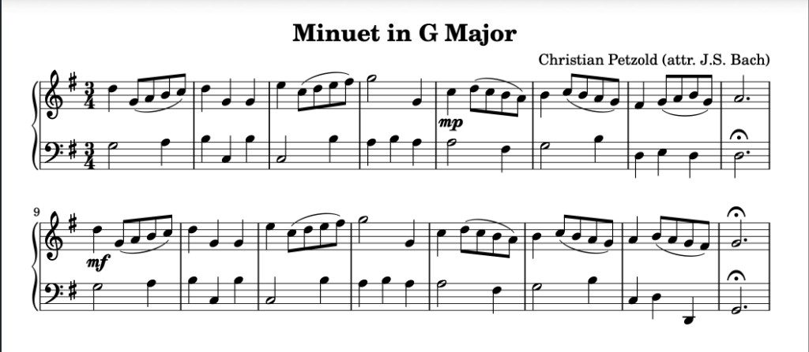

# Sheet Music

Kleis can generate publication-quality sheet music using the same pipeline as
academic papers. A musical score is defined as structured data, compiled to
[LilyPond](https://lilypond.org/) source, and rendered to PDF.

```
Score -> compile_score -> .ly -> lilypond -> .pdf
```

This mirrors the paper pipeline:

```
ArxivPaper -> compile_arxiv_paper -> .typ -> typst compile -> .pdf
```



*Petzold's Minuet in G Major rendered from `examples/music/minuet_in_g.kleis`. Two staves with brace, G major key signature, slurs, dynamics (mp, mf), and fermata — all generated from Kleis data types.*

## Quick Start

### Prerequisites

1. **Kleis** compiled and in PATH
2. **LilyPond** for engraving: `brew install lilypond`

### Your First Score (5 minutes)

Create a file `my_score.kleis`:

```kleis
import "stdlib/templates/sheet_music.kleis"

define my_score = solo_score(
    "My First Score",
    "Composer Name",
    Treble,
    KeySig(C, "major"),
    TimeSig(4, 4),
    Cons(Measure(Cons(n(C, Quarter), Cons(n(D, Quarter),
         Cons(n(E, Quarter), Cons(n(F, Quarter), Nil))))),
    Cons(Measure(Cons(n(G, Half), Cons(n(C, Half), Nil))),
    Nil))
)

example "compile" {
    let ly = compile_score(my_score) in
    out(typst_raw(ly))
}
```

Generate PDF:

```bash
kleis test --raw-output --example compile my_score.kleis > my_score.ly
lilypond my_score.ly
open my_score.pdf
```

## Data Types

The template defines types for two layers of musical notation:

### Layer 1: Syntax — Symbolic Tokens

| Type | Constructors | Description |
|------|-------------|-------------|
| `NoteName` | `C`, `D`, `E`, `F`, `G`, `A`, `B` | Note letter names |
| `Accidental` | `Natural`, `Sharp`, `Flat` | Accidentals |
| `Pitch` | `P(NoteName, Accidental, ℤ)` | Full pitch (octave 4 = middle C) |
| `Duration` | `Whole`, `Half`, `Quarter`, `Eighth`, `Sixteenth`, `Dotted(Duration)`, `Triplet(Duration)` | Note durations |
| `Clef` | `Treble`, `Bass`, `Alto`, `Tenor` | Staff clefs |
| `KeySig` | `KeySig(NoteName, String)`, `KeySigAcc(NoteName, Accidental, String)` | Key signature (root + "major"/"minor") |
| `TimeSig` | `TimeSig(ℤ, ℤ)` | Time signature (beats, beat unit) |

### Layer 1: Events and Annotations

| Type | Constructors | Description |
|------|-------------|-------------|
| `Event` | `Note(Pitch, Duration)`, `Rest(Duration)`, `Chord(List, Duration)`, `Marked(Event, List)`, `Tuplet(ℤ, ℤ, List)`, `Tempo(String)`, `Spacer(Duration)` | Things that happen in time |
| `Articulation` | `Staccato`, `Accent`, `Tenuto`, `Fermata`, `Marcato` | Articulation marks |
| `Annotation` | `Tie`, `SlurStart`, `SlurEnd`, `Artic(Articulation)`, `Dyn(Dynamic)` | Attachments to events |
| `Dynamic` | `PPP`, `PP`, `Piano`, `MP`, `MF`, `Forte`, `FF`, `FFF` | Volume markings |

### Layer 2: Structure

| Type | Constructors | Description |
|------|-------------|-------------|
| `Measure` | `Measure(List)` | List of events |
| `VoiceLine` | `VoiceLine(List)` | List of measures for one voice |
| `StaffContent` | `Staff(Clef, KeySig, TimeSig, List)`, `VoiceStaff(Clef, KeySig, TimeSig, List)` | One staff (single-voice or multi-voice) |
| `ScoreMeta` | `ScoreMeta(String, String, String)` | Title, composer, subtitle |
| `Score` | `Score(ScoreMeta, List)` | Metadata + list of staves |

## Convenience Constructors

The template provides shortcuts for common operations:

```kleis
// Notes
n(C, Quarter)                  // C4 quarter note
no(G, 5, Eighth)               // G5 eighth note
ns(F, 4, Half)                 // F#4 half note
nb(B, 3, Quarter)              // Bb3 quarter note

// Rests
r(Quarter)                     // quarter rest

// Measures
m(Cons(n(C, Quarter), ...))    // measure from event list

// Annotations
slur_start(n(C, Quarter))      // c'4(
slur_end(n(E, Quarter))        // e'4)
tied(n(D, Half))               // d'2~
staccato(n(G, Eighth))         // g'8-.
accent(n(C, Quarter))          // c'4->
fermata(n(G, Dotted(Half)))    // g'2.\fermata
dyn(n(C, Quarter), Forte)      // c'4\f

// Tuplets and tempo
triplet(e1, e2, e3)               // 3 events in the time of 2
tempo_mark("Adagio sostenuto")    // \tempo "Adagio sostenuto"
sp(Whole)                          // invisible rest (for multi-voice)

// Key signatures with accidentals
KeySigAcc(C, Sharp, "minor")      // \key cis \minor

// Score constructors
solo_score(title, composer, clef, key, time, measures)
piano_score(title, composer, key, time, treble_measures, bass_measures)
voice_piano_score(title, composer, key, time, treble_voices, bass_measures)
```

## Examples

### Solo Instrument: Ode to Joy

A 16-bar excerpt of Beethoven's theme for single voice:

```kleis
import "stdlib/templates/sheet_music.kleis"

define m1 = m(Cons(n(E, Quarter), Cons(n(E, Quarter),
         Cons(n(F, Quarter), Cons(n(G, Quarter), Nil)))))
define m2 = m(Cons(n(G, Quarter), Cons(n(F, Quarter),
         Cons(n(E, Quarter), Cons(n(D, Quarter), Nil)))))
// ... more measures ...

define ode = solo_score("Ode to Joy", "Ludwig van Beethoven",
    Treble, KeySig(C, "major"), TimeSig(4, 4), ode_measures)

example "compile" {
    out(typst_raw(compile_score(ode)))
}
```

See the full example: `examples/music/ode_to_joy.kleis`

### Piano: Minuet in G Major

A two-staff arrangement demonstrating slurs, dynamics, and key signatures:

```kleis
import "stdlib/templates/sheet_music.kleis"

define fis(oct, dur) = Note(P(F, Sharp, oct), dur)

// Right hand with slurs and dynamics
define rh1 = m(Cons(no(D, 5, Quarter),
           Cons(slur_start(no(G, 4, Eighth)),
           Cons(no(A, 4, Eighth),
           Cons(no(B, 4, Eighth),
           Cons(slur_end(no(C, 5, Eighth)), Nil))))))

// Left hand with walking bass
define lh1 = m(Cons(no(G, 3, Half), Cons(no(A, 3, Quarter), Nil)))

// Assemble as piano score (auto-detects two staves -> PianoStaff)
define minuet = piano_score(
    "Minuet in G Major",
    "Christian Petzold (attr. J.S. Bach)",
    KeySig(G, "major"),
    TimeSig(3, 4),
    treble_measures,
    bass_measures
)

example "compile" {
    out(typst_raw(compile_score(minuet)))
}
```

The `piano_score` constructor creates two staves. When `compile_score` detects
exactly two staves, it wraps them in a LilyPond `\new PianoStaff` block,
which draws a brace connecting them.

See the full example: `examples/music/minuet_in_g.kleis`

### Multi-Voice Piano: Moonlight Sonata

The opening 14 measures of Beethoven's Op. 27 No. 2 demonstrate the most
advanced features: multi-voice staves, triplet grouping, tempo markings,
and accidentaled key signatures.


*Beethoven's Moonlight Sonata (measures 1–14). Treble staff with two simultaneous voices: melody (stems up) entering at measure 5, continuous triplet arpeggiation (stems down). Bass staff with sustained octave pedal tones. C# minor, cut time.*

The three-layer texture requires a `VoiceStaff` — a staff containing
multiple `VoiceLine` objects that play simultaneously:

```kleis
import "stdlib/templates/sheet_music.kleis"

// Triplet arpeggiation pattern (3 eighths in the time of 2)
define t_csm = triplet(
    Note(P(G, Sharp, 3), Eighth),
    Note(P(C, Sharp, 4), Eighth),
    Note(P(E, Natural, 4), Eighth))

// Each measure has 4 triplet groups
define acc1 = m(Cons(t_csm, Cons(t_csm, Cons(t_csm, Cons(t_csm, Nil)))))

// Melody: spacer rests where voice 1 is silent, then enters pp
define mel1 = m(Cons(tempo_mark("Adagio sostenuto"), Cons(sp(Whole), Nil)))
define mel5 = m(Cons(sp(Half), Cons(Rest(Quarter),
             Cons(dyn(Note(P(G,Sharp,4), Dotted(Eighth)), PP),
             Cons(Note(P(G,Sharp,4), Sixteenth), Nil)))))

// Two voices share the treble staff
define treble_voices = Cons(VoiceLine(melody_measures),
                      Cons(VoiceLine(accomp_measures), Nil))

// Assemble: multi-voice treble + single-voice bass
define moonlight = voice_piano_score(
    "Sonata No. 14 'Moonlight'",
    "Ludwig van Beethoven (Op. 27, No. 2)",
    KeySigAcc(C, Sharp, "minor"),
    TimeSig(2, 2),
    treble_voices,
    bass_measures
)
```

Key features demonstrated:

- **`VoiceStaff`** compiles to `<< { \voiceOne ... } \\ { \voiceTwo ... } >>` in LilyPond, giving each voice automatic stem direction
- **`triplet(e1, e2, e3)`** compiles to `\tuplet 3/2 { e1 e2 e3 }`
- **`tempo_mark("...")`** produces `\tempo "..."` with zero duration (doesn't affect measure completeness)
- **`sp(dur)`** produces invisible rests (`s` in LilyPond) so voice 1 doesn't print rests where it's silent
- **`KeySigAcc(C, Sharp, "minor")`** compiles to `\key cis \minor`

See the full example: `examples/music/moonlight_sonata.kleis`

## Measure Completeness Verification

The template includes duration arithmetic so you can verify that measures
add up correctly:

```kleis
// Duration values (in sixteenths of a whole note)
duration_value(Whole)           // 16
duration_value(Half)            // 8
duration_value(Quarter)         // 4
duration_value(Dotted(Quarter)) // 6

// Check a measure sums to its time signature
let ts = TimeSig(4, 4) in
assert(measure_duration(my_measure) = measure_expected_duration(ts))

// Works for any time signature
let waltz = TimeSig(3, 4) in
assert(measure_expected_duration(waltz) = 12)  // 12 sixteenths
```

This catches a common notation error at compile time rather than when
LilyPond warns about it.

## LilyPond Output

The compiler translates Kleis data types to LilyPond syntax:

| Kleis | LilyPond | Description |
|-------|----------|-------------|
| `P(C, Natural, 4)` | `c'` | Middle C |
| `P(F, Sharp, 5)` | `fis''` | F# one octave above middle C |
| `P(B, Flat, 3)` | `bes` | Bb below middle C |
| `Note(P(C,Natural,4), Quarter)` | `c'4` | Quarter note |
| `Rest(Eighth)` | `r8` | Eighth rest |
| `Chord([P(C,4), P(E,4), P(G,4)], Quarter)` | `<c' e' g'>4` | C major chord |
| `slur_start(n(C, Quarter))` | `c'4(` | Begin slur |
| `dyn(n(C, Quarter), Forte)` | `c'4\f` | Dynamic marking |
| `triplet(e1, e2, e3)` | `\tuplet 3/2 { ... }` | Triplet group |
| `tempo_mark("Adagio")` | `\tempo "Adagio"` | Tempo marking |
| `sp(Whole)` | `s1` | Spacer (invisible rest) |
| `KeySigAcc(C, Sharp, "minor")` | `\key cis \minor` | Key with accidental |

## Generating PDF

### One-liner

```bash
kleis test --raw-output --example compile my_score.kleis > my_score.ly && lilypond my_score.ly && open my_score.pdf
```

### What `--raw-output` Does

- Suppresses test banners (the checkmark lines)
- `typst_raw()` in the code produces unquoted output
- Together they produce clean LilyPond source on stdout

### Bonus: MIDI

LilyPond also generates a MIDI file alongside the PDF (because the
template includes `\midi { }` in the layout block). You can play it
with any MIDI player.

## Architecture

The sheet music template follows the same pattern as the arXiv paper
template (`stdlib/templates/arxiv_paper.kleis`):

1. **Data types** define the domain vocabulary
2. **Compiler functions** translate to the target format
3. **`out(typst_raw(...))`** emits the output
4. **External tool** renders to PDF

No Rust code changes are needed. The template is pure Kleis.

## Music Theory Verification

Beyond rendering, Kleis can **verify music-theoretic properties** of a score.
The `tonal_harmony.kleis` theory provides pitch arithmetic, chord recognition,
and axiom checkers that run against any Kleis score AST.

### The Theory

Import the theory alongside a score:

```kleis
import "examples/music/moonlight_sonata.kleis"
import "stdlib/theories/tonal_harmony.kleis"
```

The theory provides three layers of functions:

| Layer | Functions | Purpose |
|-------|-----------|---------|
| **Pitch arithmetic** | `pitch_to_midi`, `pitch_class`, `interval_abs`, `interval_class` | Convert between pitch representations |
| **AST extraction** | `first_pitch`, `triplet_pitch_classes`, `extract_pcs` | Pull musical data from score structure |
| **Axiom checkers** | `check_tonic_opening`, `check_bass_smooth`, `check_arpeggio_triads`, `check_melody_consonance`, `check_no_parallels`, `check_harmonic_rhythm` | Verify music-theoretic properties |

### Verifying the Moonlight Sonata

Running the TonalHarmony theory against Beethoven's Moonlight Sonata
(measures 1–14) produces machine-checked results:

```kleis
example "axiom 1: tonic opening" {
    let tonic = Cons(1, Cons(4, Cons(8, Nil))) in  // C# minor: {C#, E, G#}
    assert(check_tonic_opening(accomp_measures, tonic) = true)
}

example "axiom 2: bass smooth motion" {
    let result = check_bass_smooth(bass_measures, 12) in
    assert(eq(result, 0 - 1))   // -1 = no violations
}

example "axiom 5: no parallel octaves" {
    let result = check_no_parallels(melody_measures, bass_measures, 0) in
    assert(eq(result, 0 - 1))
}
```

### Results

| Axiom | Result | Interpretation |
|-------|--------|----------------|
| 1. Tonic Opening | **SAT** | First arpeggiation ∈ C# minor |
| 2. Bass Smooth Motion | **SAT** | No bass leaps exceed one octave |
| 3. Arpeggio Triads | **Violation at m4** | Passing tones aren't standard triads |
| 4. Melody–Harmony Consonance | **SAT** | Every sounding melody note ∈ accompaniment chord |
| 5. No Parallel Octaves | **SAT** | No parallel octaves in outer voices |
| 6. No Parallel Fifths | **Violation at m13** | Consecutive fifths in outer voices |
| 7. Harmonic Rhythm | **8 violations** | Mid-bar harmony changes in measures 3,4,5,7,8,12,13,14 |

**Formal summary:**

```
Moonlight ⊨ TonalCohesion        (axioms 1, 2, 4, 5)
Moonlight ⊭ StrictTriadicArpeg.  (axiom 3, m4)
Moonlight ⊭ StrictCounterpoint   (axiom 6, m13)
Moonlight ⊭ UniformHarmRhythm    (axiom 7, 8 measures)
```

The SAT results show a disciplined tonal core. The violations are
**diagnostically useful** — they reveal where Beethoven exercises expressive
freedom beyond strict textbook rules. A sonata is a model, a music theory
is a set of axioms, and style is characterized by *which axioms hold, and where*.

### Running the Analysis

```bash
kleis test examples/music/moonlight_analysis.kleis
```

See the full analysis: `examples/music/moonlight_analysis.kleis`

See the theory: `stdlib/theories/tonal_harmony.kleis`

## Future Directions

### Theory Refinements

The current violations point to specific next steps:

- **Harmonic skeleton vs. surface** — Distinguish chord tones from passing
  tones, neighbor tones, and suspensions. Run axiom checks on the underlying
  harmony, not the literal note surface.
- **Contextual parallel motion** — Weight voice-leading checks by metric
  position (downbeats vs. passing motion).
- **Parameterized harmonic rhythm** — Allow one harmony change per half-bar
  in cut time, rather than requiring one per full measure.
- **Comparative musicology** — Run the same axioms against Bach, Chopin,
  and Debussy to characterize stylistic differences formally.
- **Z3-backed verification** — Express axioms as universally quantified
  constraints so Z3 can produce Skolem witnesses for violations.

### Rendering and Output

- **Native Typst rendering** — A `compile_score_typst` function for inline
  musical notation in arXiv papers, removing the LilyPond dependency.
- **Engraving axioms** — Spacing, beam grouping, collision avoidance
  formalized as verifiable constraints rather than heuristics.

See ADR-033 for the full architectural roadmap.

---

-> [Previous: Document Generation](./23-document-generation.md)
