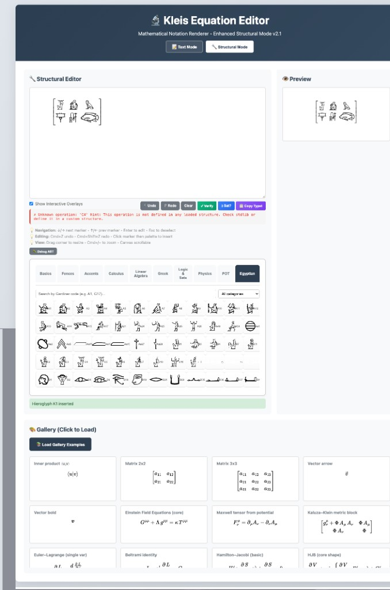
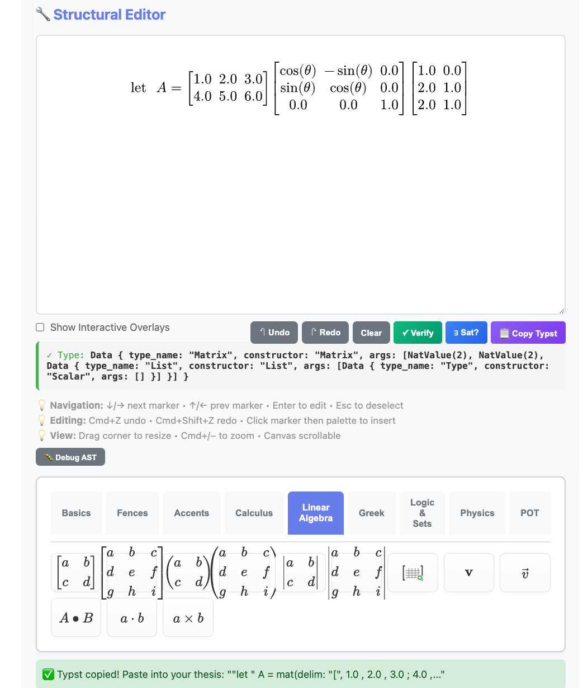

# Equation Editor

The Kleis Equation Editor is a visual, browser-based tool for building
mathematical expressions. Instead of typing LaTeX or Typst syntax by hand, you
click palette buttons to assemble an expression tree. The editor renders each
change live through the Typst compiler and can type-check, verify, and export
the result — all without leaving the browser.

## Quick Start

### Prerequisites

1. **Kleis** compiled and in PATH (see [Starting Out](01-starting-out.md))
2. A modern web browser (Chrome, Firefox, Safari, Edge)

### Launch

Start the equation editor server from the Kleis project root:

```bash
kleis-server
```

The server prints:

```
📡 Server running at: http://127.0.0.1:3000
```

Open [http://localhost:3000](http://localhost:3000) in your browser. You should
see the editor with a header bar, a structural canvas, a symbol palette, and a
gallery of examples at the bottom.

> **Note:** The server must be started from the repository root so it can find
> the `static/`, `stdlib/`, and `std_template_lib/` directories. You can
> override the host and port with the `KLEIS_SERVER_HOST` and
> `KLEIS_SERVER_PORT` environment variables.

## Editor Modes

The header provides two mode buttons:

### Text Mode

A plain textarea where you type LaTeX directly. Click **Render** to see the
MathJax preview on the right. This mode is useful for quick previews of
existing LaTeX expressions or for pasting formulas from other sources.

Text mode also provides **Verify** and **Clear** buttons.

### Structural Mode

The main mode. A large white canvas displays your expression as a live Typst
rendering (SVG). You build expressions by clicking palette buttons, which
insert template nodes into an internal AST (Abstract Syntax Tree). The editor
re-renders after every change.

Empty positions appear as green interactive overlays — these are **markers**
(also called slots or placeholders). Click a marker to select it, then click a
palette button or type a value to fill it. The canvas is scrollable and
resizable; drag the bottom-right corner to adjust its size.

<!-- TODO: add screenshot of structural mode with green markers -->

## The Palette

The palette sits below the canvas and contains ten tabs. Each tab groups
related operations.

### Basics

Arithmetic operators (`+`, `-`, `×`, `÷`, `±`, `∓`, `·`, `=`, `≠`, `∞`),
fractions, square and nth roots, powers, subscripts, superscripts, mixed
indices, binomial coefficients, and factorials. Also includes common functions:
`sin`, `cos`, `tan`, `arcsin`, `arccos`, `arctan`, `ln`, `log`, `exp`, and
`e^{·}`.

A **Piecewise** button opens a dialog for building piecewise-defined functions
with 2–10 cases.

### Fences

Delimiter pairs: parentheses `( )`, square brackets `[ ]`, curly braces
`{ }`, angle brackets `⟨ ⟩`, absolute value `| |`, double-bar norm `‖ ‖`,
floor `⌊ ⌋`, and ceiling `⌈ ⌉`. Each inserts a template that wraps the
currently selected sub-expression.

### Accents

Diacritical marks and decorations: dot, double-dot, hat, bar, tilde,
overline, underline, vector arrow, and bold.

### Calculus

Definite integrals, sums, products, limits, ordinary derivatives, partial
derivatives, and gradients. Also includes integral transforms (Fourier,
inverse Fourier, Laplace, inverse Laplace), convolution, kernel integrals,
and Green's function templates.

### Linear Algebra

Preset 2×2 and 3×3 matrices in bracket, parenthesis, and determinant styles.
A **Custom Matrix** button opens the Matrix Builder dialog (see below). Also
provides bold vector, vector arrow, and product operators (matrix multiply,
dot product, cross product).

### Greek

Lowercase (α through ω) and uppercase (Γ through Ω) Greek letters.

### Logic & Sets

Boolean constants, comparison operators (`<`, `>`, `≤`, `≥`, `≈`), logical
connectives (and, or, not, implies, iff), quantifiers (∀, ∃),
set operators (∈, ∉, ⊂, ⊆, ∪, ∩, ∅), congruence, and a `let`-binding
template.

### Physics

Quantum mechanics notation: ket, bra, inner product, outer product,
expectation value, and commutator brackets. General relativity tensors:
metric tensor `g`, Christoffel symbols `Γ`, and Riemann curvature tensor `R`.

### POT

Projection Operator Theory templates: projection operator, modal integral,
kernel `K`, causal bound, residue operator, modal space, and spacetime
manifold templates.

### Egyptian

Egyptian hieroglyphs from the Gardiner Sign List. This tab loads 225 core
signs dynamically from the server. Features:

- **Search** — type a Gardiner code (e.g. `A1`, `D21`) to filter
- **Category dropdown** — filter by Gardiner category (A: Man and Activities,
  D: Body Parts, G: Birds, M: Plants, etc.)
- **Scrollable grid** — each glyph renders as an SVG image; click to insert

Hieroglyphs are rendered through the same Typst pipeline as mathematical
symbols — they use `#image()` to embed SVG files. This means they compose
freely with all other editor features. You can place hieroglyphs inside
matrices for traditional quadrat arrangement, or mix them with mathematical
notation.



*The Egyptian tab showing the Gardiner sign palette, category filter, and a 2×3 matrix of hieroglyphs in the structural editor. The gallery of mathematical examples appears below.*

## Building Expressions

The core workflow in Structural Mode:

1. **Click a palette button** to insert a template. The template appears in the
   canvas with green overlays marking empty slots.
2. **Click a green slot** to select it. The selected slot is highlighted.
3. **Fill the slot**: click another palette button to insert a nested
   expression, or type a value directly (see Inline Editing below).
4. **Navigate** between slots with arrow keys or Tab.
5. **Repeat** until the expression is complete.
6. **Undo/Redo** with the toolbar buttons or keyboard shortcuts.

Each palette button inserts an AST node. Templates can nest arbitrarily deep:
a fraction inside a matrix inside a sum inside an integral is built one click
at a time. The editor re-renders after every insertion.

**Replacing content:** If you insert a template into a slot that already has
content, the editor shows a confirmation dialog asking whether to replace
the existing content.

## Inline Editing

Clicking a marker (green slot) opens an inline text input directly on the
canvas. This lets you type values, variable names, or symbols without leaving
the structural view.

- **Enter** — commit the value and close the input
- **Escape** — cancel and close without changes
- **Tab** — commit and move to the next slot

While the inline input is active, clicking palette buttons appends symbols to
the input rather than replacing the entire slot.

**Modifier-click:** Hold Shift, Ctrl, or Cmd while clicking a slot to open a
standard prompt dialog instead of the inline editor.

## Keyboard Shortcuts

| Shortcut | Action |
|----------|--------|
| `↓` or `→` | Next marker |
| `↑` or `←` | Previous marker |
| `Tab` | Next marker |
| `Shift+Tab` | Previous marker |
| `Enter` | Edit selected marker |
| `Escape` | Deselect marker |
| `Cmd+Z` / `Ctrl+Z` | Undo |
| `Cmd+Shift+Z` / `Ctrl+Shift+Z` | Redo |
| `Cmd++` / `Ctrl++` | Zoom in |
| `Cmd+-` / `Ctrl+-` | Zoom out |
| `Cmd+0` / `Ctrl+0` | Reset zoom |

Keyboard shortcuts are active when the structural canvas has focus. They are
disabled while typing in the inline editor or other text inputs.

## Matrix Builder

The **Custom Matrix** button (in the Linear Algebra tab) opens a dialog for
creating matrices of any size:

1. **Size selection** — hover over a 6×6 grid to preview dimensions, or type
   exact values (1–10 rows, 1–10 columns) into the numeric fields.
2. **Delimiter style** — choose one of four delimiter types:

| Style | Description | Typst Environment |
|-------|-------------|-------------------|
| `[ ]` | Square brackets | `bmatrix` |
| `( )` | Parentheses | `pmatrix` |
| `\| \|` | Vertical bars (determinant) | `vmatrix` |
| `{ }` | Curly braces | `Bmatrix` |

3. Click **Create Matrix** to insert. Each cell appears as an editable marker.

If a marker is currently selected when you open the Matrix Builder, the new
matrix is inserted into that slot, allowing you to nest matrices inside other
expressions.

## Type Checking

After each render, the editor automatically runs Hindley-Milner type inference
on your expression. A type indicator panel appears below the toolbar:

- **Green border with ✓** — type inference succeeded. Shows the inferred type
  (e.g. `Scalar`, `Matrix(2, 2, Scalar)`, `Complex`).
- **Red border with ✗** — type inference found an error (e.g. dimension
  mismatch in matrix multiplication).
- **💡 Suggestion** — an orange hint with additional context.



*The type indicator confirms `Matrix(2, 2, Scalar)` for a matrix multiplication involving a rotation matrix.*

Type checking uses the same Hindley-Milner inference engine as the Kleis
language itself, with type definitions loaded from the standard library. An
"Unknown operation" message for new template types (such as hieroglyphs) is
informational — it does not prevent rendering or export.

## Verify and Sat

Two buttons invoke the Z3 SMT solver on your expression:

### Verify (✓)

Tests whether the expression is a **valid** (always-true) proposition. The
result is one of:

- **VALID** — the proposition holds for all values
- **INVALID** — Z3 found a counterexample (displayed below the result)
- **UNKNOWN** — Z3 could not determine validity within the timeout

### Sat (∃?)

Tests whether the expression is **satisfiable** — whether there exists at
least one assignment of values that makes it true. The result is:

- **SATISFIABLE** — Z3 found a witness (displayed below)
- **UNSATISFIABLE** — no assignment exists
- **UNKNOWN** — undetermined

Both buttons require the expression to be fully filled in (no empty markers).
If markers remain, the result is `incomplete`.

## Exporting

### Copy Typst

The **Copy Typst** button in the structural toolbar sends the current AST to
the server, which produces the equivalent Typst source code. The result is
copied to your clipboard.

You can paste this directly into a `.kleis` document. For example, building
a matrix multiplication visually, then clicking Copy Typst, produces
something like:

```typst
mat(delim: "[", 1 , 2 , 3 ; 4 , 5 , 6) dot mat(delim: "(", cos(theta) , -sin(theta) ; sin(theta) , cos(theta))
```

The editor is especially useful for complex expressions — nested matrices,
tensor notation with mixed indices, piecewise functions — where hand-writing
Typst syntax is tedious and error-prone. You can also write Typst math
directly in your `.kleis` source files if you prefer; the editor and inline
Typst are complementary approaches.

```
Visual Editor → Copy Typst → Paste into thesis.kleis → PDF
```

See [Document Generation](23-document-generation.md) for the full compilation
pipeline.

### Debug AST

The **🐛 Debug AST** button toggles a panel showing the raw JSON AST of your
expression. This is useful for understanding the editor's internal
representation or for debugging templates.

The debug panel provides:

- **Copy** — copies the JSON to clipboard
- **Download** — saves the AST as a `.json` file

## The Gallery

The bottom of the page shows a gallery of example expressions. Click any card
to load it into the editor. Gallery examples cover a wide range:

- **Linear algebra** — inner products, matrices, vectors, determinants
- **Physics** — Einstein field equations, Maxwell tensor, Kaluza-Klein metric,
  Schrödinger equation, Pauli matrices, quantum states
- **Calculus** — limits, double/triple integrals, Euler-Lagrange,
  Hamilton-Jacobi
- **Analysis** — Riemann zeta (Dirichlet series, Euler product, Mellin
  integral), Gaussian integral
- **Set theory and logic** — membership, quantifiers, implications
- **Trigonometry** — sin, cos, tan, hyperbolic functions, Euler formula
- **Accents** — velocity (dot), acceleration (double-dot), averages (bar)
- **Statistics** — variance, covariance
- **Number theory** — congruence modulo, Fermat's little theorem
- **Rich matrices** — matrices with fractions, square roots, rotation matrices
- **Ellipsis patterns** — horizontal, vertical, diagonal dots in sequences and
  matrices
- **Piecewise functions** — absolute value, sign function

Loading a gallery example replaces the current expression. The gallery is
populated from the server and loads automatically on page load.

## Egyptian Hieroglyphs

The Egyptian tab demonstrates the editor's extensibility beyond mathematics.
225 core signs from the Gardiner Sign List are available, rendered as SVG
images through Typst's `#image()` function.

### Browsing and Inserting

Open the **Egyptian** tab in the palette. The glyphs load from the server
and appear as a scrollable grid of image buttons. Each button shows the SVG
rendering and the Gardiner code as a tooltip.

**Search:** Type a code like `A1` or `M17` in the search box to filter.

**Category filter:** Use the dropdown to filter by Gardiner category:

| Category | Description |
|----------|-------------|
| A | Man and his activities |
| B | Woman and her activities |
| C | Anthropomorphic deities |
| D | Parts of the human body |
| E | Mammals |
| F | Parts of mammals |
| G | Birds |
| H | Parts of birds |
| I | Amphibians, reptiles |
| K | Fish and parts of fish |
| L | Invertebrates |
| M | Trees and plants |
| N | Sky, earth, water |
| O | Buildings and parts |
| P | Ships and parts |
| Q | Domestic and funerary furniture |
| R | Temple furniture, sacred emblems |
| S | Crowns, dress, staves |
| T | Warfare, hunting, butchery |
| U | Agriculture, crafts |
| V | Rope, fibre, baskets |
| W | Vessels |
| X | Loaves and cakes |
| Y | Writings, games, music |
| Z | Strokes and geometric figures |
| Aa | Unclassified |

Click a glyph button to insert it at the current marker position.

### Quadrat Composition

Traditional Egyptian writing arranges signs in rectangular groups (quadrats).
The editor supports this naturally through matrices:

1. Insert a matrix from the **Linear Algebra** tab (e.g. 2×3 with bracket
   delimiters).
2. Click each cell marker and insert a hieroglyph from the **Egyptian** tab.
3. The result is a quadrat — a grid of hieroglyphs rendered through Typst.

The Copy Typst output for a hieroglyph matrix looks like:

```typst
mat(delim: "[",
  #box(image("static/glyphs/egyptian/C4.svg", height: 1.5em)) ,
  #box(image("static/glyphs/egyptian/A2.svg", height: 1.5em)) ,
  #box(image("static/glyphs/egyptian/G17.svg", height: 1.5em)) ;
  #box(image("static/glyphs/egyptian/P5.svg", height: 1.5em)) ,
  #box(image("static/glyphs/egyptian/Y3.svg", height: 1.5em)) ,
  #box(image("static/glyphs/egyptian/K1.svg", height: 1.5em)))
```

This can be pasted into any Kleis document and compiled to PDF.

### Technical Details

Each hieroglyph is defined as a zero-argument operation in
`std_template_lib/egyptian.kleist`. The template specifies a Typst rendering
rule that embeds the SVG file:

```
@template A1 {
    pattern: "A1()"
    typst: "#box(image(\"static/glyphs/egyptian/A1.svg\", height: 1.5em))"
    category: "egyptian_A_man"
    glyph: "A1"
    svg: "static/glyphs/egyptian/A1.svg"
}
```

The glyphs are MIT-licensed SVGs from the PharaLex project, stored in
`static/glyphs/egyptian/`.

## Extending the Editor

New domains can be added to the equation editor without modifying Rust code.
The extension mechanism uses `.kleist` template files:

1. **Create a `.kleist` file** in `std_template_lib/` with `@template` blocks
   defining the operations, their Typst renderings, and metadata (category,
   glyph labels, SVG paths).
2. **Add assets** (SVG images, fonts) to `static/`.
3. **Add a palette tab** in `std_template_lib/palette.kleist` with a
   `@symbol_picker` annotation for dynamic loading.

The Egyptian hieroglyph integration was built entirely this way — no server
code changes were needed for the glyph rendering itself.

This architecture means the same editor can serve as a substrate for sheet
music notation, chemical formulas, circuit diagrams, or any domain that has
visual symbols and compositional rules.
---

-> [Previous: Document Generation](./23-document-generation.md) | [Next: Sheet Music](./30-sheet-music.md)
