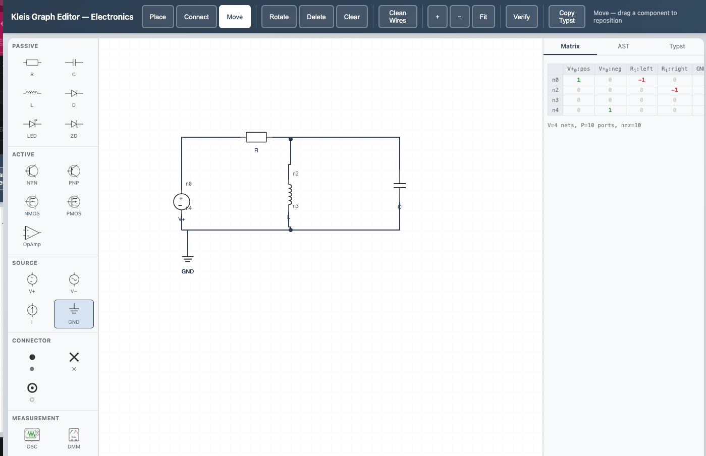
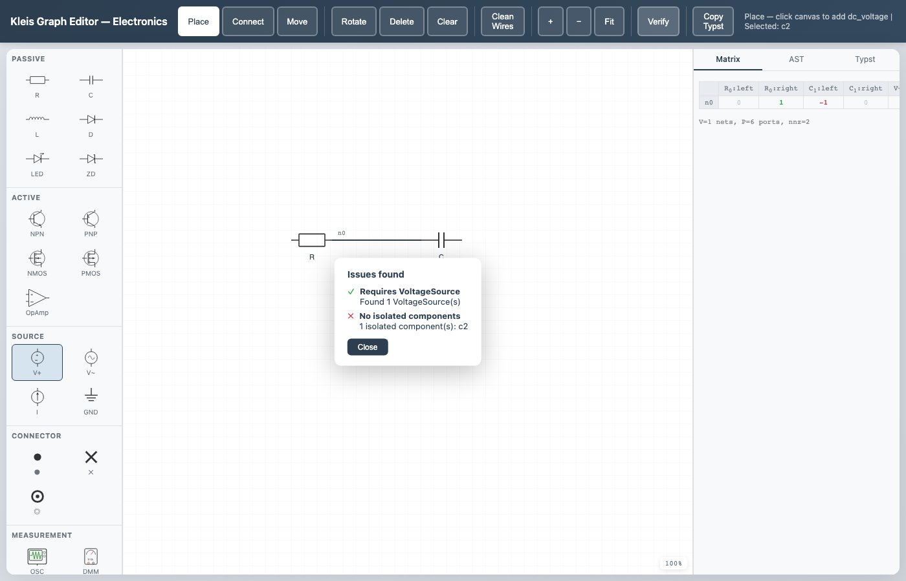
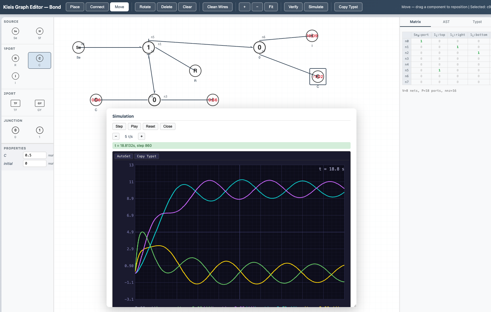

# Graph Editor

The Kleis Graph Editor is a visual, browser-based tool for building
domain-specific graph schematics. You place typed components from a palette,
wire their ports together, and the editor maintains a signed incidence matrix,
an AST, and a Typst rendering of the schematic — all updated live. Structural
verification (with optional Z3 backing) and time-domain simulation are built
in.



*The electronics domain showing an astable multivibrator circuit with obstacle-aware routing and wire crossing hops. The palette (left) lists Passive, Active, Source, Connector, and Measurement components. The incidence matrix (right) updates live as components are wired.*

## Quick Start

### Prerequisites

1. **Kleis** compiled and in PATH (see [Starting Out](01-starting-out.md))
2. A modern web browser (Chrome, Firefox, Safari, Edge)

### Launch

Start the server from the Kleis project root:

```bash
kleis-server
```

Then open the Graph Editor at
[http://localhost:3000/static/graph_editor.html](http://localhost:3000/static/graph_editor.html).

To load a specific domain, add a `?domain=` query parameter:

```
http://localhost:3000/static/graph_editor.html?domain=electronics
http://localhost:3000/static/graph_editor.html?domain=bond
http://localhost:3000/static/graph_editor.html?domain=petri
http://localhost:3000/static/graph_editor.html?domain=graph_theory
```

The domain filter controls which palette sections and domain configuration
(routing style, edge decorations, verification rules, simulation mode) are
loaded.

> **Note:** The server must be started from the repository root so it can find
> the `static/`, `stdlib/`, and `std_template_lib/` directories.

## Domains

The Graph Editor is domain-agnostic. Its behavior is configured entirely by
`.kleist` template files loaded from the server at startup. Any template whose
metadata includes a `ports` field becomes a placeable component; templates
whose name starts with `__domain_` inject domain-wide configuration without
appearing in the palette.

Domain configuration keys control:

| Key | Effect |
|-----|--------|
| `routing_mode` | Wire routing: `orthogonal` (Manhattan bends) or `direct` (straight lines) |
| `junction_style` | Multi-port junction appearance: `dot` or `none` |
| `multi_port_strategy` | How legs fan out from a junction: `trunk_branch` or `star` |
| `edge_decoration` | Marker on wire endpoints: `none`, `arrow`, `half_arrow`, `inhibitor`, `causal_bar` |
| `edge_direction` | `undirected` or `directed` |
| `verify_*` | Structural verification rules (see [Verification](#verification)) |
| `sim_mode` | Simulation mode: `discrete` or `continuous` |

### Shipped Domains

Kleis ships with four domains:

| Domain | Description | Routing | Decoration | Simulation |
|--------|-------------|---------|------------|------------|
| **electronics** | Passive and active circuit components | orthogonal | none | continuous (nonlinear MNA) |
| **bond_graph** | Bond graph modeling (effort/flow) | direct | half_arrow | continuous (linear state-space) |
| **petri_net** | Petri nets (places, transitions, arcs) | orthogonal | arrow | discrete |
| **graph_theory** | Generic vertices and edges | direct | none | — |

Each domain is defined by `.kleist` files in `std_template_lib/` and SVG
assets in `static/svg/`. New domains can be added without modifying Rust code.

## Interface Layout

The editor has a three-panel layout with a toolbar header:

```
┌──────────────────────── Header / Toolbar ────────────────────────┐
│ Place  Connect  Move │ Rotate Del Clear │ Clean │ + − Fit │      │
│                      │ Wires           │ Verify Simulate  │      │
│                      │                 │ Copy Typst │ Save SaveAs Load │
├──────────┬───────────────────────────────┬────────────────┤
│ Palette  │                               │  Output Panel  │
│          │         SVG Canvas            │  ┌──────────┐  │
│ [Section]│                               │  │Matrix│AST│  │
│  ○ Item  │   Components + Wires          │  │  Typst   │  │
│  ○ Item  │                               │  │          │  │
│          │                               │  │          │  │
│──────────│                               │  │          │  │
│Properties│                               │  │          │  │
│  R: 1000 │                          100% │  │          │  │
└──────────┴───────────────────────────────┴────────────────┘
```

- **Palette** (left) — component categories and items, loaded from templates.
  Below the palette sits the **Properties** panel for the selected component.
- **Canvas** (center) — SVG drawing surface with a 20 px grid. Components are
  placed and wired here. A zoom indicator appears in the bottom-right corner.
- **Output Panel** (right) — three tabs showing live representations of the
  graph: Matrix, AST, and Typst.


## Modes

The editor has three interaction modes, selectable from the toolbar or by
keyboard shortcut. The active mode is highlighted in the toolbar and displayed
in the status bar.

### Place Mode (P)

1. Select a component from the palette (it highlights blue).
2. Click anywhere on the canvas to place it.
3. The component snaps to the 20 px grid.

Each component renders its SVG symbol and exposes colored port circles on
hover. The status bar shows which component type is selected.

### Connect Mode (C)

1. Click a port circle on one component to start a wire.
2. A dashed rubber-band preview follows your cursor.
3. Click a port on another component to complete the connection.

The editor creates a **net** — a set of connected ports that corresponds to a
row in the incidence matrix. If you connect a port that already belongs to an
existing net, the nets merge into a single hyperedge. This supports multi-way
junctions naturally.

Wire routing follows the domain's `routing_mode`:

- **Orthogonal** — Manhattan-style paths with right-angle bends. The preview
  snaps to horizontal and vertical segments.
- **Direct** — straight line from port to port.

### Move Mode (M)

Click and drag a component to reposition it. Connected wires automatically
reroute to follow the component.

## Editing

### Rotate and Delete

- **Rotate** (R) — rotates the selected component 90° clockwise.
- **Delete** (Del / Backspace) — deletes the selected component or wire.
  Deleting a component also removes all its net connections.
- **Clear** — removes all components and wires from the canvas.

### Wire Editing

In orthogonal routing mode, wires have editable bend points:

- **Drag a segment** — hover over a horizontal or vertical wire segment (the
  cursor changes to a resize arrow) and drag to slide the bend.
- **Double-click a segment** — inserts a new pair of bend points, giving you
  finer control over the route.
- **Double-click a bend dot** — simplifies the route by removing redundant
  bends.
- **Clean Wires** — toolbar button that recomputes the default route for every
  wire in the schematic.

### Properties Panel

When a component is selected, the Properties panel (below the palette) shows
its editable parameters. These are defined by the template's `params` metadata
— for example, a resistor has an `R` parameter, a capacitor has `C`.

Changing a parameter value immediately updates the Matrix, AST, and Typst
outputs.

### Causal Stroke (K)

In the bond graph domain, selecting a wire and pressing **K** cycles the
causal stroke through three states: stroke at the *end* port, stroke at the
*start* port, and *off*. Causal strokes appear as bar markers on the wire
ends and are included in Typst export and in the causality verification
checks.

## Navigation

| Action | Input |
|--------|-------|
| Zoom in/out | Mouse wheel (cursor-centered) |
| Zoom in/out | **+** / **−** toolbar buttons |
| Fit to content | **Fit** toolbar button |
| Pan | Middle-mouse drag |
| Pan | Hold **Space** + drag (cursor changes to grab hand) |

The current zoom level is displayed as a percentage in the bottom-right corner
of the canvas.

## Keyboard Shortcuts

| Key | Action |
|-----|--------|
| `P` | Switch to Place mode |
| `C` | Switch to Connect mode |
| `M` | Switch to Move mode |
| `R` | Rotate selected component 90° |
| `K` | Toggle causal stroke on selected wire |
| `Delete` / `Backspace` | Delete selected component or wire |
| `Escape` | Cancel current connection / clear selection |
| `Space` (hold) | Pan mode (drag to pan) |
| `Ctrl+S` / `Cmd+S` | Save graph to current file (or Save As if no file) |

Keyboard shortcuts are disabled while focus is in a text input, textarea, or
select element.

## Output Panels

The right panel has three tabs that update live as you edit the schematic.

### Matrix

Displays the **signed incidence matrix** as a dense table. Rows are nets,
columns are ports. The first connection on a net is marked **+1** (green),
subsequent connections are **−1** (red), and unconnected cells show **0**
(grey). The matrix dimensions (nets × ports) are shown above the table.

### AST

Shows the JSON representation of the graph as an editor AST node. This is the
`graph(...)` expression that would be evaluated by the Kleis runtime —
containing the `SparseMatrix` topology and per-component operation data.

### Typst

Generates the Typst source code for the schematic, with placed `#image`
calls for component symbols and `#line` calls for wires. Edge decorations
(arrows, causal bars, etc.) are included when the domain specifies them.

The **Copy Typst** toolbar button copies this output to your clipboard. You
can paste it directly into a `.kleis` document and compile to PDF.

## Verification

The **Verify** toolbar button runs a two-phase verification:

### Phase 1: Structural Checks (Client-Side)

These checks run instantly in the browser. Which checks run depends on the
domain's `verify_*` configuration keys:

| Rule | Config Key | Description |
|------|-----------|-------------|
| Bipartite structure | `verify_bipartite` | Arcs must cross between two specified groups (e.g. places and transitions in Petri nets) |
| Exactly one of type | `verify_exactly_one` | Exactly one component of a given type must exist |
| Requires type | `verify_requires_type` | At least one component of a given type must exist |
| No isolated components | `verify_no_isolated` | Every component must be connected to at least one net |
| All connected | `verify_all_connected` | The graph must be a single connected component (BFS reachability) |
| Causality constraints | `verify_causality` | Bond graph junction causality rules are satisfied |

### Phase 2: Z3 Verification (Server-Side)

If the domain specifies a `verify_theory`, the editor sends the graph topology
and component data to `POST /api/verify_graph`. The server loads the named
Kleis theory, encodes the graph constraints, and runs Z3 to check domain
axioms. Results appear as additional pass/fail items in the verification
overlay.

The overlay shows a summary (all checks passed / issues found) with
per-rule pass/fail icons. Click **Close** to dismiss.



*The verification overlay reporting "Issues found" — one passing check (Requires VoltageSource) and one failing check (No isolated components).*

## Simulation

The **Simulate** toolbar button opens a floating panel for time-domain
simulation. The panel is draggable (via its title bar) and resizable. The
simulation mode is determined by the domain's `sim_mode` configuration.

### Controls

| Button | Action |
|--------|--------|
| **Step** | Advance one simulation step |
| **Play** / **Pause** | Toggle continuous playback |
| **Reset** | Reset state to initial values (runs setup for continuous mode) |
| **Close** | Close the simulation panel |
| **−** / **+** | Decrease / increase playback speed |

The speed indicator shows steps per second (sps) for discrete mode, or
time-constants per second (τ/s) for continuous mode with eigenvalue-adaptive
stepping.

### Discrete Simulation

Used by domains like Petri nets. Each step:

1. The server evaluates which components are **enabled** (e.g., transitions
   with sufficient tokens). Enabled components pulse with a green outline on
   the canvas.
2. One enabled component fires (round-robin scheduling).
3. The state vector updates and the canvas overlay reflects the new state.
   Components with `show_state: true` display their current value.
4. A **history list** logs each step with the fired component name.

If no component is enabled, the simulation reports **halted**.

### Continuous Simulation

Used by domains like electronics and bond graphs. Continuous simulation has a
setup phase and a stepping phase:

1. **Reset** sends the graph to `POST /api/simulate_setup`, which queries the
   domain theory for system dimensions (state variable count, input count,
   initial conditions). For linear domains (bond graphs) it also extracts
   state-space matrices (A, B) via Z3 probes. The status bar reports the
   number of state variables, inputs, time step (dt), and the fastest time
   constant (τ) if available.
2. **Step** / **Play** sends state vectors to `POST /api/simulate_graph`.
   The server calls the theory's `sim_step(i)` function for each state
   variable — the theory owns the integration method. Bond graphs use RK4
   on a linear state-space model; electronics uses Newton-Raphson on the
   full nonlinear MNA system. Each server call integrates a chunk of steps
   (default 100) and returns the updated state.
3. An **oscilloscope** display renders the trajectory as colored traces on a
   dark background with grid lines and axis labels. The oscilloscope supports:
   - **AutoSet** — automatically scales time and voltage divisions to fit the
     visible traces
   - **Copy Typst** — exports the oscilloscope plot as Typst source for
     inclusion in documents



*The bond graph domain running a continuous simulation. The oscilloscope shows colored traces for each state variable over time, with AutoSet and Copy Typst controls. Component state values are overlaid on the canvas.*

## Save and Load

Graphs can be saved to and loaded from `.kleis` files. The save format uses
Kleis `define` statements, making saved files valid Kleis programs that are
human-readable, git-diffable, and hand-editable.

### Saving

- **Save** (toolbar button or `Ctrl+S` / `Cmd+S`) — saves the current graph
  to its existing file path. If no file has been saved or loaded yet, this
  behaves as Save As.
- **Save As** — prompts for a filename. The file is saved under
  `examples/{domain}/graph-editor/{name}.kleis`.

The saved file contains the full graph state: component positions, rotations,
parameter values, net connections, waypoints, and causal strokes. Simulation
state (A/B matrices, token counts) is not saved — it is recomputed when the
graph is next simulated.

### Loading

- **Load** — fetches the list of saved graphs for the current domain from the
  server. Pick a file by number from the list, and the graph is loaded onto the
  canvas.

On load, the editor clears the current graph, rebuilds all components and nets
from the file, auto-routes wires, and fits the view to the loaded content.

### File Format

A saved graph is a valid `.kleis` program:

```kleis
define graph_domain = "electronics"

define graph_components = [
    ["c0", "dc_voltage", "VoltageSource", 100, 150, 0, [5.0]],
    ["c1", "resistor",   "Resistor",      300, 150, 0, [1000.0]],
    ["c2", "ground",     "Ground",        100, 400, 0, []]
]

define graph_nets = [
    ["n0", [["c0", "pos"], ["c1", "left"]], []],
    ["n1", [["c1", "right"], ["c2", "pin"]], []]
]
```

Each component entry is `[id, template_name, component_type, x, y, rotation, [params...]]`.
Parameter values follow the order defined in the `.kleist` template's `params:`
metadata. Each net entry is `[id, connections, waypoints]`, where connections
are `[componentId, portName]` pairs preserving connection order.

### Seed Files

Kleis ships with example graphs for each domain that you can load immediately:

| File | Domain | Circuit |
|------|--------|---------|
| `examples/electronics/graph-editor/rectifier.kleis` | electronics | Half-wave rectifier (DC source, diode, R, C, ground) |
| `examples/electronics/graph-editor/multivibrator.kleis` | electronics | Astable multivibrator (2 BJTs, 4 resistors, 2 capacitors) |
| `examples/bond-graph/graph-editor/rc_circuit.kleis` | bond_graph | RC circuit (effort source, 1-junction, R, C) |
| `examples/petri-nets/graph-editor/linear.kleis` | petri_net | Linear workflow (source, 2 transitions, place, sink) |

## Adding New Domains

The Graph Editor's domain-agnostic architecture means new domains can be
created without modifying any Rust code:

1. **Create `.kleist` template files** in `std_template_lib/` with `@template`
   blocks. Each component template needs `ports` metadata defining the
   connection points as `name:x,y` pairs.
2. **Add a `__domain_*` template** to configure routing, decorations,
   verification rules, and simulation mode.
3. **Add SVG assets** to `static/svg/<domain>/` for component symbols.
4. **Optionally add a theory file** (`.kleis`) for Z3-backed verification.
   For simulation, the theory must define `sim_step(i)` (returns the next
   value of state variable `i`), `sim_halted()`, and setup helpers
   (`sim_state_count`, `sim_state_map`, `sim_initial_state`, etc.).

The editor discovers the new domain at startup via `/api/templates`.

---

-> [Previous: Equation Editor](./31-equation-editor.md) | [Next: Sheet Music](./30-sheet-music.md)
